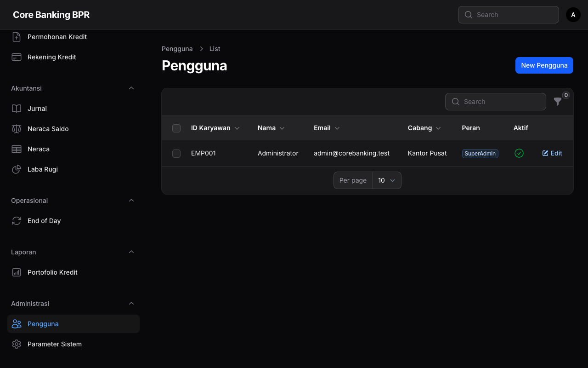
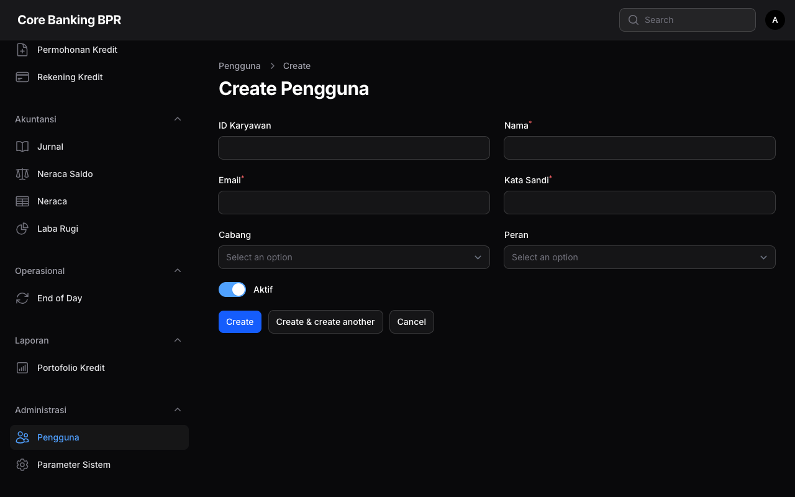

# Manajemen Pengguna

Modul ini digunakan untuk mengelola pengguna (user) aplikasi Core Banking BPR, termasuk penetapan peran dan cabang.

## Persyaratan Akses

| Peran | Akses |
|-------|-------|
| SuperAdmin | Penuh (lihat, tambah, ubah, hapus, assign role) |

## Tampilan Daftar Pengguna

### Kolom Tabel

| Kolom | Deskripsi |
|-------|-----------|
| **Employee ID** | Nomor induk karyawan |
| **Nama** | Nama lengkap pengguna |
| **Email** | Alamat email (digunakan untuk login) |
| **Cabang** | Cabang penempatan |
| **Peran** | Peran yang ditetapkan (badge) |
| **Aktif** | Status aktif/nonaktif (ikon boolean) |

### Filter

| Filter | Deskripsi |
|--------|-----------|
| Cabang | Filter berdasarkan cabang penempatan |
| Status Aktif | Filter aktif/nonaktif/semua |

## Form Pengguna

### Field Form

| Field | Tipe | Keterangan |
|-------|------|------------|
| **Employee ID** | Text | Nomor induk karyawan, wajib diisi |
| **Nama** | Text | Nama lengkap pengguna |
| **Email** | Email | Alamat email untuk login, harus unik |
| **Password** | Password | Kata sandi (wajib saat pembuatan, opsional saat edit) |
| **Cabang** | Select | Cabang penempatan pengguna |
| **Peran** | Multi-select | Satu atau lebih peran (relasi) |
| **Aktif** | Toggle | Status aktif, default: aktif |

## Panduan Operasional

### Menambah Pengguna Baru

1. Klik tombol **Buat Pengguna** di halaman daftar
2. Isi **Employee ID** dan **Nama** lengkap
3. Masukkan **Email** (akan digunakan untuk login)
4. Buat **Password** yang aman
5. Pilih **Cabang** penempatan
6. Tetapkan **Peran** sesuai jabatan (bisa lebih dari satu)
7. Pastikan toggle **Aktif** dalam keadaan aktif
8. Klik **Simpan**

### Mengubah Password Pengguna

1. Buka halaman edit pengguna
2. Isi field **Password** dengan password baru
3. Kosongkan jika tidak ingin mengubah password
4. Klik **Simpan**

### Menonaktifkan Pengguna

1. Buka halaman edit pengguna
2. Matikan toggle **Aktif**
3. Klik **Simpan**

!!! warning "Perhatian"
    Pengguna yang dinonaktifkan tidak dapat login ke aplikasi. Pastikan tidak ada sesi teller aktif sebelum menonaktifkan pengguna Teller.

### Menetapkan Peran

1. Buka halaman edit pengguna
2. Pada field **Peran**, pilih satu atau lebih peran
3. Klik **Simpan**

!!! info "Peran Tersedia"
    Terdapat 8 peran: SuperAdmin, BranchManager, CustomerService, Teller, LoanOfficer, Accounting, Auditor, Compliance. Lihat [Peran Pengguna](../memulai/peran-pengguna.md) untuk detail hak akses.

!!! tip "Tips"
    Seorang pengguna dapat memiliki lebih dari satu peran. Misalnya, seorang Kepala Cabang bisa ditetapkan sebagai BranchManager sekaligus CustomerService.

## Catatan Penting

!!! danger "Penting"
    - Setiap pengguna **harus** memiliki minimal satu peran untuk dapat mengakses fitur aplikasi
    - Email bersifat **unik** dan tidak dapat digunakan oleh lebih dari satu akun
    - Pengguna SuperAdmin memiliki akses penuh ke seluruh fitur tanpa batasan
    - Pengguna yang dihapus tidak dapat dipulihkan
