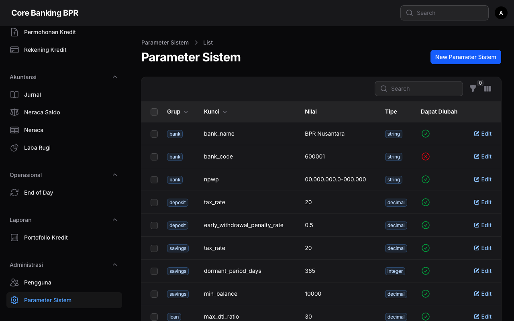

# Parameter Sistem

Modul ini digunakan untuk mengelola konfigurasi dan parameter sistem aplikasi Core Banking BPR.

## Persyaratan Akses

| Peran | Akses |
|-------|-------|
| SuperAdmin | Penuh (lihat, tambah, ubah, hapus) |
| Accounting | Lihat saja |

## Tampilan Daftar Parameter

### Kolom Tabel

| Kolom | Deskripsi |
|-------|-----------|
| **Grup** | Kategori parameter (badge) |
| **Key** | Kunci parameter (unik per grup) |
| **Value** | Nilai parameter |
| **Tipe** | Tipe data (badge): string, integer, decimal, boolean, date |
| **Deskripsi** | Penjelasan parameter (dapat disembunyikan) |
| **Dapat Diubah** | Apakah parameter dapat diubah (boolean) |

### Filter

| Filter | Deskripsi |
|--------|-----------|
| Grup | Filter berdasarkan kategori parameter |

## Form Parameter

### Field Form

| Field | Tipe | Keterangan |
|-------|------|------------|
| **Grup** | Text | Kategori parameter (contoh: general, interest, tax) |
| **Key** | Text | Kunci unik parameter |
| **Value** | Textarea | Nilai parameter |
| **Tipe** | Select | Tipe data: string, integer, decimal, boolean, date |
| **Deskripsi** | Text | Penjelasan fungsi parameter |
| **Dapat Diubah** | Toggle | Apakah parameter bisa diubah via UI (default: ya) |

## Contoh Parameter Umum

| Grup | Key | Contoh Value | Deskripsi |
|------|-----|-------------|-----------|
| general | bank_name | BPR Contoh Sejahtera | Nama bank |
| general | bank_code | 0001 | Kode bank |
| interest | savings_min_rate | 1.5 | Suku bunga minimum tabungan (%) |
| tax | tax_rate | 20 | Tarif pajak bunga (%) |
| tax | tax_threshold | 240000 | Threshold pajak bunga (Rp) |
| eod | eod_cutoff_time | 16:00 | Waktu cutoff EOD |

## Panduan Operasional

### Menambah Parameter Baru

1. Klik tombol **Buat Parameter** di halaman daftar
2. Isi **Grup** sesuai kategori
3. Masukkan **Key** yang deskriptif
4. Isi **Value** sesuai tipe data
5. Pilih **Tipe** data yang sesuai
6. Tambahkan **Deskripsi** yang jelas
7. Klik **Simpan**

### Mengubah Nilai Parameter

1. Klik ikon edit pada parameter yang diinginkan
2. Ubah **Value** sesuai kebutuhan
3. Klik **Simpan**

!!! warning "Perhatian"
    Parameter yang ditandai **Tidak Dapat Diubah** tidak bisa diedit melalui antarmuka. Perubahan harus dilakukan langsung di database oleh administrator sistem.

!!! danger "Penting"
    Mengubah parameter sistem dapat berdampak langsung pada operasional aplikasi. Pastikan Anda memahami fungsi parameter sebelum mengubahnya.

!!! tip "Tips"
    Gunakan filter Grup untuk menemukan parameter tertentu dengan cepat. Parameter dikelompokkan berdasarkan modul atau fungsi terkait.
