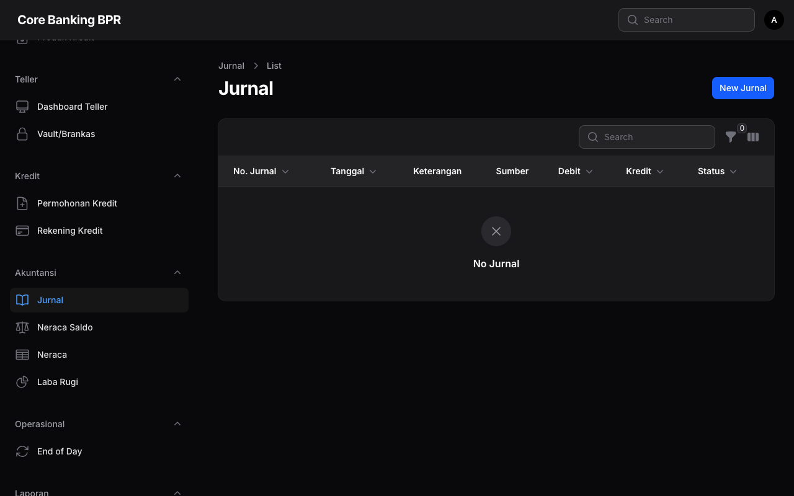
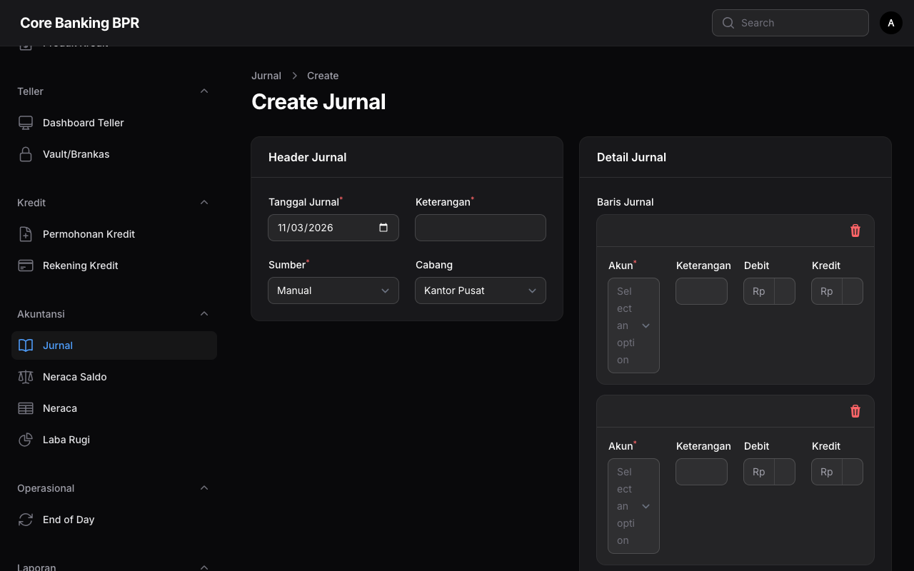

# Jurnal Umum

Modul Jurnal Umum digunakan untuk mencatat seluruh transaksi akuntansi dalam sistem Core Banking BPR. Setiap transaksi keuangan yang terjadi akan menghasilkan jurnal dengan detail debit dan kredit yang seimbang.

## Hak Akses

| Role | Akses |
|------|-------|
| Accounting | Buat, edit, posting, reverse jurnal |
| Auditor | Lihat saja (view only) |

## Daftar Jurnal

Halaman daftar jurnal menampilkan seluruh entri jurnal yang telah dibuat dalam sistem.

### Kolom Tabel

| Kolom | Keterangan |
|-------|------------|
| Nomor Jurnal | Nomor unik jurnal, dapat dicari dan disalin (searchable, copyable) |
| Tanggal | Tanggal transaksi jurnal |
| Deskripsi | Keterangan singkat mengenai transaksi |
| Sumber | Asal jurnal ditampilkan sebagai badge: **Manual**, **System**, **Teller**, atau **EOD** |
| Total Debit | Jumlah total debit dalam format Rupiah |
| Total Kredit | Jumlah total kredit dalam format Rupiah |
| Status | Status jurnal ditampilkan sebagai badge: **Draft**, **Posted**, atau **Reversed** |
| Dibuat Oleh | Nama pengguna yang membuat jurnal |
| Tanggal Posting | Tanggal jurnal diposting ke buku besar |

### Filter

Daftar jurnal dapat difilter berdasarkan:

- **Status** — Draft, Posted, atau Reversed
- **Sumber** — Manual, System, Teller, atau EOD
- **Cabang** — Filter berdasarkan cabang/kantor

## Membuat Jurnal Baru

Untuk membuat jurnal baru, klik tombol **Buat Jurnal** pada halaman daftar.

Isi informasi berikut:

1. **Tanggal** — Pilih tanggal transaksi
2. **Deskripsi** — Masukkan keterangan transaksi
3. **Sumber** — Pilih sumber jurnal
4. **Lines (Detail Jurnal)** — Tambahkan baris debit dan kredit

!!! warning "Penting"
    Total debit dan total kredit harus seimbang (balance) sebelum jurnal dapat disimpan.

## Detail Jurnal (Infolist)

Halaman detail jurnal menampilkan informasi lengkap dalam beberapa section:

### Info Jurnal

| Field | Keterangan |
|-------|------------|
| Nomor Jurnal | Nomor unik jurnal |
| Tanggal | Tanggal transaksi |
| Deskripsi | Keterangan transaksi |
| Sumber | Asal jurnal (Manual/System/Teller/EOD) |
| Status | Status saat ini |
| Cabang | Cabang terkait |

### Totals

| Field | Keterangan |
|-------|------------|
| Total Debit | Jumlah seluruh debit dalam Rupiah |
| Total Kredit | Jumlah seluruh kredit dalam Rupiah |

### History

| Field | Keterangan |
|-------|------------|
| Created By | Pengguna yang membuat jurnal |
| Created At | Waktu pembuatan |
| Posted At | Waktu posting |
| Reversed By | Pengguna yang melakukan reversal |
| Reversed At | Waktu reversal |
| Reversal Reason | Alasan reversal |

## Relation Manager: Lines

Setiap jurnal memiliki detail baris (lines) yang menunjukkan akun-akun yang terlibat dalam transaksi.

| Kolom | Keterangan |
|-------|------------|
| Kode Akun | Kode akun pada Chart of Accounts |
| Nama Akun | Nama lengkap akun |
| Debit | Jumlah debit dalam Rupiah |
| Kredit | Jumlah kredit dalam Rupiah |
| Keterangan | Catatan tambahan per baris |

## Status Jurnal

Jurnal memiliki tiga status dengan alur kerja sebagai berikut:

### Draft

- Jurnal baru dibuat dengan status **Draft**
- Dapat diedit dan diubah
- Dapat disetujui/posting oleh pengguna yang berwenang

### Posted

- Jurnal yang telah diposting bersifat **final**
- Tidak dapat diedit lagi
- Dapat di-reverse jika terdapat kesalahan

### Reversed

- Jurnal yang telah dibatalkan
- Wajib menyertakan **alasan reversal**
- Sistem akan membuat jurnal pembalik secara otomatis

!!! info "Alur Status"
    Draft → Posted → Reversed (opsional)

!!! note "Catatan"
    Jurnal yang bersumber dari **System**, **Teller**, atau **EOD** dibuat secara otomatis oleh sistem dan umumnya langsung berstatus Posted.
