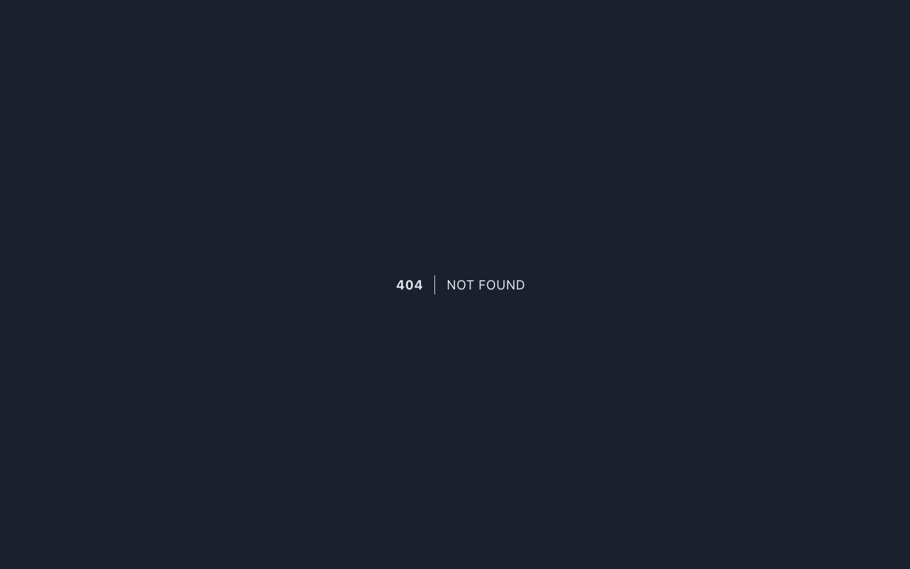

# Neraca Saldo

Neraca Saldo (Trial Balance) adalah laporan yang menampilkan saldo seluruh akun pada Chart of Accounts untuk periode tertentu. Laporan ini digunakan untuk memverifikasi bahwa total debit dan kredit dalam buku besar telah seimbang.

## Hak Akses

| Role | Permission | Akses |
|------|-----------|-------|
| Accounting | `report.view` | Lihat dan generate laporan |
| Manager | `report.view` | Lihat dan generate laporan |
| Auditor | `report.view` | Lihat laporan |

## Mengakses Neraca Saldo

Halaman Neraca Saldo merupakan custom page pada Filament yang dapat diakses melalui:

- **URL:** `/admin/trial-balance`
- **Menu:** Akuntansi → Neraca Saldo

## Cara Penggunaan

### Pemilihan Periode

Sebelum generate laporan, pilih periode yang diinginkan:

1. **Tahun** — Pilih tahun laporan
2. **Bulan** — Pilih bulan laporan

Setelah memilih periode, klik tombol **Generate** untuk menampilkan neraca saldo.

### Kolom Laporan

Laporan Neraca Saldo menampilkan data per akun dengan kolom sebagai berikut:

| Kolom | Keterangan |
|-------|------------|
| Kode Akun | Kode akun sesuai Chart of Accounts |
| Nama Akun | Nama lengkap akun |
| Saldo Awal — Debit | Saldo debit awal periode |
| Saldo Awal — Kredit | Saldo kredit awal periode |
| Mutasi — Debit | Total mutasi debit selama periode |
| Mutasi — Kredit | Total mutasi kredit selama periode |
| Saldo Akhir — Debit | Saldo debit akhir periode |
| Saldo Akhir — Kredit | Saldo kredit akhir periode |

## Perhitungan

Neraca Saldo dihitung menggunakan **AccountingService** dengan logika sebagai berikut:

- **Saldo Awal** = Saldo akun pada awal periode (sebelum tanggal 1 bulan terpilih)
- **Mutasi** = Total transaksi debit dan kredit selama periode berjalan
- **Saldo Akhir** = Saldo Awal + Mutasi Debit - Mutasi Kredit (untuk akun bersaldo normal debit), atau sebaliknya untuk akun bersaldo normal kredit

!!! info "Validasi"
    Pada neraca saldo yang benar, total kolom Saldo Akhir Debit harus sama dengan total kolom Saldo Akhir Kredit. Jika tidak seimbang, terdapat kesalahan pencatatan yang perlu diperiksa.

!!! tip "Tips"
    Gunakan Neraca Saldo sebagai langkah awal sebelum menyusun laporan Neraca dan Laba Rugi untuk memastikan data akuntansi telah seimbang.
