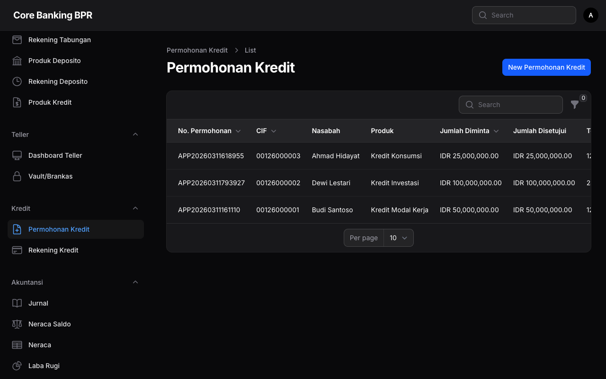
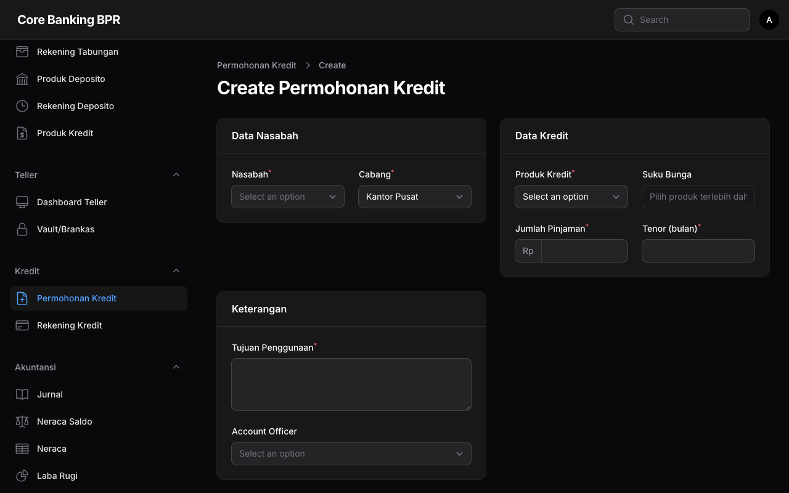
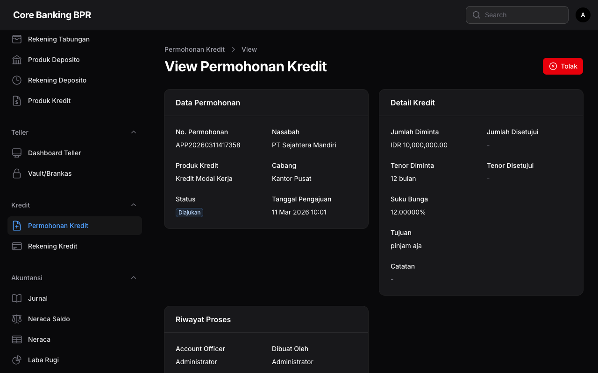

# Permohonan Kredit

Halaman **Permohonan Kredit** digunakan untuk mengelola seluruh pengajuan kredit nasabah. Setiap permohonan memiliki nomor unik yang digenerate otomatis dan melalui alur persetujuan bertahap mulai dari pengajuan hingga pencairan atau penolakan.

---

## Hak Akses

| Role           | Lihat          | Tambah | Ubah  | Hapus |
|----------------|:--------------:|:------:|:-----:|:-----:|
| SuperAdmin     | Semua cabang   | Ya     | Ya    | Ya    |
| Auditor        | Semua cabang   | Tidak  | Tidak | Tidak |
| Compliance     | Semua cabang   | Tidak  | Tidak | Tidak |
| BranchManager  | Semua cabang   | Tidak  | Tidak | Tidak |
| LoanOfficer    | Cabang sendiri | Ya     | Ya    | Tidak |
| CustomerService| Cabang sendiri | Tidak  | Tidak | Tidak |
| Teller         | Cabang sendiri | Tidak  | Tidak | Tidak |

!!! info "Informasi"
    Hanya **LoanOfficer** dan **SuperAdmin** yang dapat membuat permohonan kredit baru. Role **BranchManager** bertugas melakukan review dan persetujuan permohonan. Role lainnya hanya memiliki akses lihat sesuai cakupan cabang masing-masing.

---

## Daftar Permohonan Kredit

Halaman daftar menampilkan seluruh permohonan kredit yang terdaftar dalam sistem sesuai dengan hak akses pengguna.



### Kolom Tabel

| Kolom            | Keterangan                                                                  |
|------------------|-----------------------------------------------------------------------------|
| Nomor Permohonan | Nomor unik permohonan kredit yang digenerate otomatis oleh sistem.          |
| CIF              | Nomor Customer Information File nasabah pemohon.                            |
| Nama Nasabah     | Nama lengkap nasabah yang mengajukan permohonan kredit.                     |
| Produk           | Nama produk kredit yang dipilih.                                            |
| Jumlah Diminta   | Nominal pinjaman yang diajukan oleh nasabah dalam Rupiah.                   |
| Jumlah Disetujui | Nominal pinjaman yang disetujui oleh bank dalam Rupiah. Kosong jika belum disetujui. |
| Tenor Diminta    | Jangka waktu pinjaman yang diminta oleh nasabah dalam satuan bulan.         |
| Status           | Status permohonan ditampilkan sebagai badge berwarna.                       |
| Tanggal          | Tanggal pengajuan permohonan kredit.                                        |

### Filter yang Tersedia

| Filter        | Keterangan                                                           |
|---------------|----------------------------------------------------------------------|
| Status        | Filter berdasarkan status permohonan: Submitted, UnderReview, Approved, Disbursed, Rejected. |
| Produk Kredit | Filter berdasarkan produk kredit yang diajukan.                      |

!!! tip "Tips"
    Gunakan kombinasi filter **Status** dan **Produk Kredit** untuk mempercepat pencarian permohonan. Misalnya, filter status **UnderReview** untuk melihat permohonan yang menunggu review.

---

## Status Permohonan

Permohonan kredit memiliki alur status sebagai berikut:

| Status       | Badge   | Keterangan                                                                 |
|--------------|---------|----------------------------------------------------------------------------|
| Submitted    | Abu-abu | Permohonan baru diajukan oleh Loan Officer dan menunggu review.            |
| UnderReview  | Kuning  | Permohonan sedang dalam proses review dan analisis oleh pejabat berwenang. |
| Approved     | Biru    | Permohonan telah disetujui dan siap untuk dicairkan.                       |
| Disbursed    | Hijau   | Kredit telah dicairkan dan rekening kredit telah dibuat.                    |
| Rejected     | Merah   | Permohonan ditolak. Alasan penolakan wajib diisi.                          |

### Diagram Alur Status

```
Submitted ──► UnderReview ──► Approved ──► Disbursed
    │              │              │
    └──────────────┴──────────────┘
                   │
               Rejected
```

!!! warning "Perhatian"
    Permohonan yang sudah berstatus **Disbursed** atau **Rejected** tidak dapat diubah kembali. Pastikan seluruh data telah diverifikasi sebelum melakukan persetujuan atau pencairan.

---

## Formulir Permohonan Kredit

Formulir permohonan kredit diisi oleh Loan Officer saat nasabah mengajukan pinjaman baru.



### Detail Field

| Field             | Tipe        | Wajib | Keterangan                                                        |
|-------------------|-------------|:-----:|-------------------------------------------------------------------|
| Nomor Permohonan  | Text        | -     | Digenerate otomatis oleh sistem. Tidak dapat diubah.              |
| Nasabah           | Select      | Ya    | Pilih nasabah berdasarkan nama atau nomor CIF.                    |
| Produk Kredit     | Select      | Ya    | Pilih produk kredit yang tersedia dan aktif.                      |
| Cabang            | Select      | Ya    | Cabang tempat permohonan diajukan.                                |
| Jumlah Diminta    | Numeric     | Ya    | Nominal pinjaman yang diminta oleh nasabah.                       |
| Tenor Diminta     | Numeric     | Ya    | Jangka waktu pinjaman yang diminta dalam bulan.                   |
| Suku Bunga        | Numeric (%) | Ya    | Suku bunga per tahun. Terisi otomatis dari produk kredit.         |
| Tujuan            | Textarea    | Ya    | Tujuan penggunaan dana pinjaman.                                  |
| Catatan           | Textarea    | Tidak | Catatan tambahan dari Loan Officer.                               |

!!! note "Catatan"
    Suku bunga terisi otomatis berdasarkan produk kredit yang dipilih, namun dapat disesuaikan oleh Loan Officer dalam batas yang diperbolehkan. Jumlah dan tenor yang diminta akan divalidasi terhadap batas minimum dan maksimum yang diatur pada produk kredit.

---

## Detail Permohonan (View)

Halaman detail menampilkan informasi lengkap permohonan kredit dalam format infolist (hanya baca).



### Informasi yang Ditampilkan

| Field              | Keterangan                                                         |
|--------------------|--------------------------------------------------------------------|
| Nomor Permohonan   | Nomor unik permohonan kredit.                                      |
| Nasabah            | Nama dan nomor CIF nasabah pemohon.                                |
| Produk Kredit      | Nama produk kredit yang dipilih.                                   |
| Cabang             | Cabang tempat permohonan diajukan.                                 |
| Status             | Status terkini permohonan ditampilkan sebagai badge.               |
| Tanggal Dibuat     | Tanggal permohonan pertama kali diajukan.                          |
| Jumlah Diminta     | Nominal pinjaman yang diajukan nasabah.                            |
| Jumlah Disetujui   | Nominal pinjaman yang disetujui oleh bank.                         |
| Tenor Diminta      | Jangka waktu pinjaman yang diminta (bulan).                        |
| Tenor Disetujui    | Jangka waktu pinjaman yang disetujui (bulan).                      |
| Suku Bunga         | Persentase suku bunga per tahun.                                   |
| Tujuan             | Tujuan penggunaan dana pinjaman.                                   |
| Catatan            | Catatan tambahan dari Loan Officer.                                |
| Loan Officer       | Nama petugas Loan Officer yang membuat permohonan.                 |
| Created By         | Pengguna yang membuat permohonan dalam sistem.                     |
| Approved By        | Pejabat yang menyetujui permohonan.                                |
| Tanggal Persetujuan| Tanggal permohonan disetujui.                                      |
| Disbursed At       | Tanggal dan waktu pencairan kredit.                                |
| Rejection Reason   | Alasan penolakan (hanya tampil jika status Rejected).              |

---

## Relation Manager: Agunan (Collaterals)

Pada halaman detail permohonan, terdapat tab **Agunan** yang menampilkan daftar jaminan yang diserahkan nasabah.

| Field            | Keterangan                                                    |
|------------------|---------------------------------------------------------------|
| Tipe Agunan      | Jenis agunan (Sertifikat Tanah, BPKB, Deposito, dll).        |
| Deskripsi        | Keterangan detail mengenai agunan.                            |
| Nilai Taksasi    | Nilai estimasi agunan berdasarkan hasil penilaian.            |
| Nilai Pengikatan | Nilai pengikatan agunan yang ditetapkan oleh bank.            |
| Status           | Status agunan (Aktif, Dilepas, dll).                          |

!!! tip "Tips"
    Pastikan total nilai agunan memenuhi rasio Loan to Value (LTV) yang disyaratkan oleh produk kredit sebelum mengajukan permohonan untuk persetujuan.

---

## Panduan Langkah demi Langkah

### Membuat Permohonan Kredit Baru

1. Buka menu **Kredit > Permohonan Kredit**.
2. Klik tombol **Tambah Permohonan** di pojok kanan atas.
3. Pilih **Nasabah** dengan mencari berdasarkan nama atau nomor CIF.
4. Pilih **Produk Kredit** yang sesuai dengan kebutuhan nasabah.
5. Isi **Jumlah Diminta** sesuai nominal yang diajukan nasabah.
6. Isi **Tenor Diminta** sesuai jangka waktu yang diinginkan.
7. Periksa **Suku Bunga** yang terisi otomatis dari produk kredit.
8. Isi **Tujuan** penggunaan dana pinjaman.
9. Tambahkan **Catatan** jika diperlukan.
10. Klik **Simpan** untuk menyimpan permohonan.
11. Sistem akan menghasilkan **Nomor Permohonan** secara otomatis dengan status **Submitted**.
12. Lanjutkan ke halaman detail untuk menambahkan data **Agunan**.

### Menambahkan Agunan pada Permohonan

1. Buka halaman detail permohonan kredit.
2. Pilih tab **Agunan (Collaterals)**.
3. Klik tombol **Tambah Agunan**.
4. Isi tipe agunan, deskripsi, nilai taksasi, dan nilai pengikatan.
5. Klik **Simpan** untuk menyimpan data agunan.
6. Ulangi langkah 3-5 jika nasabah memiliki lebih dari satu agunan.

### Melihat Riwayat Permohonan

1. Buka menu **Kredit > Permohonan Kredit**.
2. Gunakan filter **Status** untuk menyaring permohonan berdasarkan tahap proses.
3. Klik pada baris permohonan untuk membuka halaman detail.

!!! info "Informasi"
    Permohonan yang berstatus **Submitted** masih dapat diubah oleh Loan Officer yang membuatnya. Setelah status berubah menjadi **UnderReview** atau lebih lanjut, permohonan tidak dapat diedit lagi.

---

## Lihat Juga

- [Persetujuan & Pencairan](persetujuan-pencairan.md)
- [Rekening Kredit](rekening-kredit.md)
- [Produk Kredit](../master-data/produk-kredit.md)
- [Nasabah](../master-data/nasabah.md)
