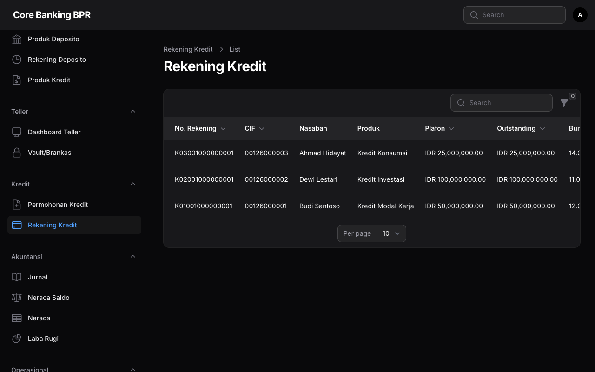
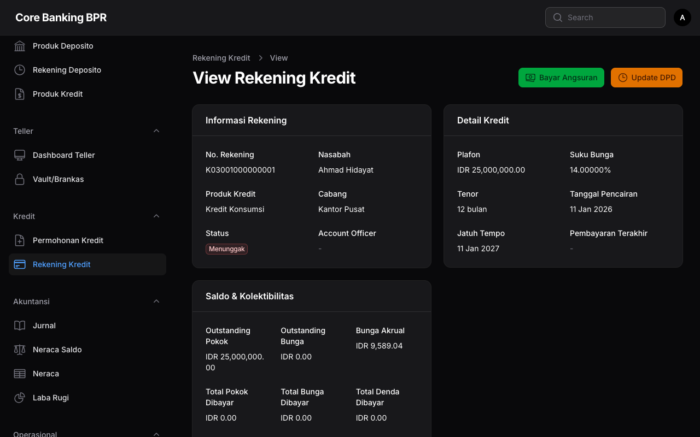

# Rekening Kredit

Halaman **Rekening Kredit** (Loan Account) menampilkan seluruh rekening kredit yang telah dicairkan. Setiap rekening kredit dibuat secara otomatis oleh sistem saat proses pencairan permohonan kredit dan berisi informasi lengkap tentang saldo, kolektibilitas, jadwal angsuran, riwayat pembayaran, serta data agunan.

---

## Hak Akses

| Role           | Lihat          | Tambah | Ubah  | Hapus |
|----------------|:--------------:|:------:|:-----:|:-----:|
| SuperAdmin     | Semua cabang   | -      | -     | -     |
| Auditor        | Semua cabang   | -      | -     | -     |
| Compliance     | Semua cabang   | -      | -     | -     |
| BranchManager  | Semua cabang   | -      | -     | -     |
| LoanOfficer    | Cabang sendiri | -      | -     | -     |
| Teller         | Cabang sendiri | -      | -     | -     |
| CustomerService| Cabang sendiri | -      | -     | -     |

!!! info "Informasi"
    Rekening kredit dibuat secara otomatis oleh sistem pada saat pencairan dan bersifat **hanya baca** (view-only). Tidak ada pengguna yang dapat menambah, mengubah, atau menghapus rekening kredit secara manual. Pembuatan rekening kredit hanya terjadi melalui proses pencairan permohonan kredit.

---

## Daftar Rekening Kredit

Halaman daftar menampilkan seluruh rekening kredit sesuai dengan hak akses pengguna.

### Kolom Tabel

| Kolom              | Keterangan                                                                  |
|--------------------|-----------------------------------------------------------------------------|
| Nomor Rekening     | Nomor rekening kredit yang digenerate otomatis oleh sistem.                  |
| CIF                | Nomor Customer Information File nasabah peminjam.                           |
| Nama Nasabah       | Nama lengkap nasabah pemilik rekening kredit.                               |
| Produk             | Nama produk kredit yang digunakan.                                          |
| Pokok              | Nominal pokok pinjaman awal dalam Rupiah.                                   |
| Outstanding Pokok  | Sisa pokok pinjaman yang belum dibayar dalam Rupiah.                        |
| Suku Bunga         | Persentase suku bunga per tahun.                                            |
| DPD                | Days Past Due - jumlah hari keterlambatan, ditampilkan dengan kode warna.   |
| Kolektibilitas     | Tingkat kolektibilitas ditampilkan sebagai badge berwarna.                  |
| Status             | Status rekening kredit ditampilkan sebagai badge.                           |
| Tanggal Pencairan  | Tanggal kredit dicairkan.                                                   |
| Tanggal Jatuh Tempo| Tanggal jatuh tempo terakhir seluruh pinjaman.                              |

### Kode Warna DPD

DPD (Days Past Due) ditampilkan dengan warna yang menunjukkan tingkat keterlambatan:

| DPD         | Warna         | Keterangan                     |
|-------------|---------------|--------------------------------|
| 0           | Hijau         | Tidak ada keterlambatan.       |
| 1 - 30      | Kuning        | Keterlambatan ringan.          |
| 31 - 60     | Oranye        | Keterlambatan sedang.          |
| 61 - 90     | Merah         | Keterlambatan tinggi.          |
| > 90        | Merah gelap   | Keterlambatan sangat tinggi.   |

!!! warning "Perhatian"
    Rekening kredit dengan DPD lebih dari 90 hari memerlukan perhatian khusus dan perlu ditinjau untuk menentukan langkah restrukturisasi atau penanganan kredit bermasalah.

### Filter yang Tersedia

| Filter          | Keterangan                                                         |
|-----------------|---------------------------------------------------------------------|
| Status          | Filter berdasarkan status rekening: Active, Closed, WrittenOff.     |
| Kolektibilitas  | Filter berdasarkan tingkat kolektibilitas (Kol 1 - Kol 5).         |
| Produk Kredit   | Filter berdasarkan produk kredit yang digunakan.                    |

!!! tip "Tips"
    Gunakan filter **Kolektibilitas** untuk memantau kredit bermasalah. Filter kolektibilitas **3, 4, atau 5** untuk melihat kredit Non-Performing Loan (NPL).

---

## Detail Rekening Kredit (View)

Halaman detail menampilkan informasi lengkap rekening kredit dalam format infolist (hanya baca).

### Section: Informasi Rekening (Account Info)

| Field              | Keterangan                                                         |
|--------------------|--------------------------------------------------------------------|
| Nomor Rekening     | Nomor rekening kredit unik.                                        |
| CIF                | Nomor Customer Information File nasabah.                           |
| Nama Nasabah       | Nama lengkap nasabah pemilik rekening.                             |
| Produk Kredit      | Nama produk kredit.                                                |
| Cabang             | Cabang tempat rekening kredit terdaftar.                           |
| Status             | Status rekening (Active, Closed, WrittenOff).                      |
| Tanggal Pencairan  | Tanggal kredit dicairkan.                                          |
| Tanggal Jatuh Tempo| Tanggal jatuh tempo akhir seluruh pinjaman.                        |

### Section: Detail Pinjaman (Loan Details)

| Field              | Keterangan                                                         |
|--------------------|--------------------------------------------------------------------|
| Pokok Pinjaman     | Nominal pokok pinjaman awal (jumlah yang dicairkan).               |
| Suku Bunga         | Persentase suku bunga per tahun.                                   |
| Tenor              | Jangka waktu pinjaman dalam bulan.                                 |
| Tipe Bunga         | Metode perhitungan bunga (Flat, Efektif, Sliding).                 |
| Angsuran per Bulan | Nominal angsuran bulanan (untuk tipe Flat dan Efektif).            |

### Section: Saldo & Kolektibilitas (Balance & Collectibility)

| Field                  | Keterangan                                                     |
|------------------------|-----------------------------------------------------------------|
| Outstanding Pokok      | Sisa pokok pinjaman yang belum dibayar.                         |
| Outstanding Bunga      | Sisa bunga yang belum dibayar.                                  |
| Accrued Interest       | Bunga yang telah diakui namun belum diterima pembayarannya.     |
| Total Pokok Dibayar    | Total pembayaran pokok yang telah diterima.                     |
| Total Bunga Dibayar    | Total pembayaran bunga yang telah diterima.                     |
| Total Denda Dibayar    | Total pembayaran denda keterlambatan yang telah diterima.       |
| DPD                    | Days Past Due ditampilkan dengan kode warna sesuai tabel di atas.|
| Kolektibilitas         | Tingkat kolektibilitas (Kol 1-5) ditampilkan sebagai badge.    |
| CKPN Amount            | Jumlah cadangan kerugian yang harus dibentuk berdasarkan kolektibilitas. |

!!! note "Catatan"
    Nilai DPD, Kolektibilitas, dan CKPN Amount diperbarui secara otomatis oleh proses **End of Day (EOD)**. Nilai yang ditampilkan merupakan posisi terakhir berdasarkan proses EOD terakhir.

---

## Relation Manager

Halaman detail rekening kredit memiliki 3 tab relasi:

### 1. Schedules (Jadwal Angsuran)

Menampilkan jadwal angsuran bulanan yang digenerate saat pencairan.

| Kolom              | Keterangan                                            |
|--------------------|-------------------------------------------------------|
| Angsuran ke        | Nomor urut angsuran (1, 2, 3, dst).                   |
| Tanggal Jatuh Tempo| Tanggal jatuh tempo pembayaran angsuran.              |
| Pokok              | Porsi pokok pada angsuran tersebut.                   |
| Bunga              | Porsi bunga pada angsuran tersebut.                   |
| Total Angsuran     | Total angsuran (pokok + bunga).                       |
| Sisa Pokok         | Sisa pokok setelah pembayaran angsuran tersebut.      |

### 2. Payments (Riwayat Pembayaran)

Menampilkan riwayat pembayaran angsuran yang telah diterima.

| Kolom              | Keterangan                                            |
|--------------------|-------------------------------------------------------|
| Tanggal Bayar      | Tanggal pembayaran angsuran diterima.                 |
| Jumlah Bayar       | Total nominal pembayaran yang diterima.               |
| Pokok Dibayar      | Porsi pembayaran yang dialokasikan untuk pokok.       |
| Bunga Dibayar      | Porsi pembayaran yang dialokasikan untuk bunga.       |
| Denda              | Denda keterlambatan yang dibayarkan (jika ada).       |

### 3. Collaterals (Agunan)

Menampilkan daftar agunan yang terkait dengan rekening kredit.

| Kolom              | Keterangan                                            |
|--------------------|-------------------------------------------------------|
| Tipe Agunan        | Jenis agunan (Sertifikat Tanah, BPKB, Deposito, dll).|
| Deskripsi          | Keterangan detail mengenai agunan.                    |
| Nilai Taksasi      | Nilai estimasi agunan berdasarkan penilaian.          |
| Nilai Pengikatan   | Nilai pengikatan agunan yang ditetapkan bank.         |
| Status             | Status agunan (Aktif, Dilepas).                       |

---

## Status Rekening Kredit

| Status      | Keterangan                                                                    |
|-------------|-------------------------------------------------------------------------------|
| Active      | Rekening kredit aktif dan masih memiliki saldo outstanding.                   |
| Closed      | Kredit telah lunas. Seluruh pokok dan bunga telah dibayar.                    |
| WrittenOff  | Kredit telah dihapus buku karena tidak dapat ditagih (write-off).             |

---

## Panduan Langkah demi Langkah

### Melihat Detail Rekening Kredit

1. Buka menu **Kredit > Rekening Kredit**.
2. Gunakan filter atau pencarian untuk menemukan rekening yang diinginkan.
3. Klik pada baris rekening untuk membuka halaman detail.
4. Periksa informasi pada masing-masing section: Account Info, Loan Details, dan Balance & Collectibility.

### Memeriksa Jadwal Angsuran

1. Buka halaman detail rekening kredit.
2. Pilih tab **Schedules (Jadwal Angsuran)**.
3. Periksa tanggal jatuh tempo, porsi pokok, dan porsi bunga setiap angsuran.
4. Bandingkan dengan tab **Payments** untuk memastikan pembayaran berjalan sesuai jadwal.

### Memantau Kredit Bermasalah

1. Buka menu **Kredit > Rekening Kredit**.
2. Gunakan filter **Kolektibilitas** dan pilih **Kol 3**, **Kol 4**, atau **Kol 5**.
3. Periksa DPD dan outstanding pada masing-masing rekening.
4. Koordinasikan dengan Loan Officer terkait untuk langkah penanganan.

!!! danger "Kredit Bermasalah"
    Rekening kredit dengan kolektibilitas **Kurang Lancar** (Kol 3), **Diragukan** (Kol 4), atau **Macet** (Kol 5) termasuk dalam kategori Non-Performing Loan (NPL). Diperlukan langkah penanganan segera sesuai kebijakan bank dan ketentuan regulator.

---

## Lihat Juga

- [Permohonan Kredit](permohonan-kredit.md)
- [Persetujuan & Pencairan](persetujuan-pencairan.md)
- [Jadwal Angsuran](jadwal-angsuran.md)
- [Kolektibilitas & CKPN](kolektibilitas-ckpn.md)
- [Produk Kredit](../master-data/produk-kredit.md)
