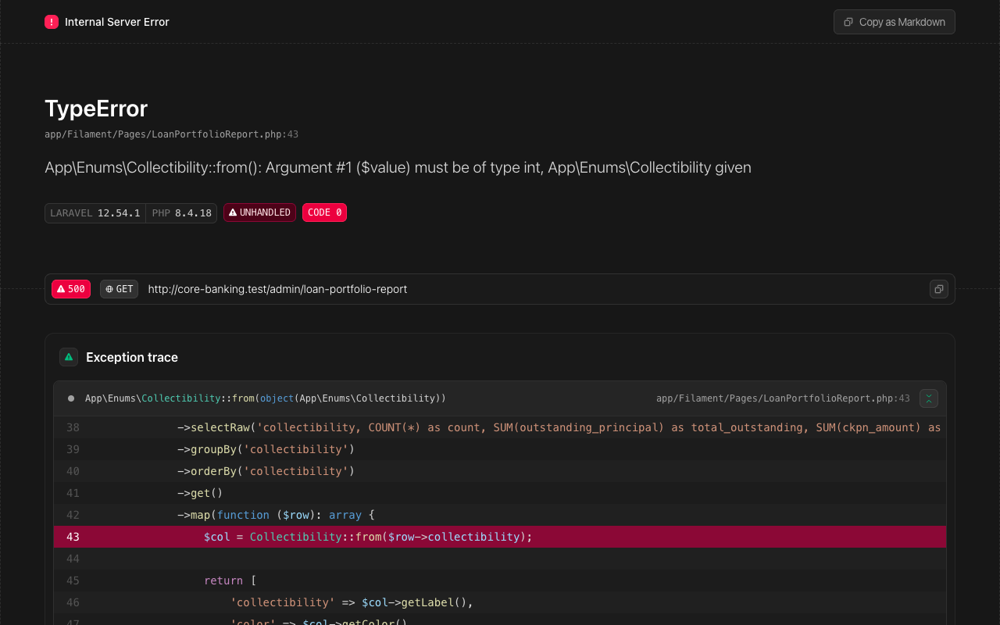

# Portofolio Kredit

Laporan Portofolio Kredit menyajikan ringkasan kondisi seluruh kredit yang diberikan oleh BPR, dikelompokkan berdasarkan kolektibilitas dan produk kredit. Laporan ini penting untuk pemantauan risiko kredit dan pelaporan ke OJK.

## Hak Akses

| Role | Permission | Akses |
|------|-----------|-------|
| Accounting | `report.view` | Lihat laporan |
| Manager | `report.view` | Lihat laporan |
| Auditor | `report.view` | Lihat laporan |

## Mengakses Laporan

Halaman Portofolio Kredit merupakan custom page pada Filament yang dapat diakses melalui:

- **URL:** `/admin/loan-portfolio-report`
- **Menu:** Laporan → Portofolio Kredit

## Tabel Laporan

### 1. Portofolio Berdasarkan Kolektibilitas

Menampilkan distribusi kredit berdasarkan tingkat kolektibilitas sesuai ketentuan OJK.

| Kolom | Keterangan |
|-------|------------|
| Kolektibilitas | Tingkat kolektibilitas (Lancar, Dalam Perhatian Khusus, Kurang Lancar, Diragukan, Macet) |
| Jumlah Rekening | Banyaknya rekening kredit pada kolektibilitas tersebut |
| Outstanding | Total saldo pokok kredit yang belum dibayar dalam Rupiah |
| CKPN | Cadangan Kerugian Penurunan Nilai yang dibentuk dalam Rupiah |
| CKPN Rate | Persentase CKPN terhadap outstanding |

Tingkat kolektibilitas mengikuti ketentuan:

| Kol | Klasifikasi | Keterangan |
|-----|-------------|------------|
| 1 | Lancar | Tidak ada tunggakan atau tunggakan kurang dari ketentuan |
| 2 | Dalam Perhatian Khusus | Terdapat tunggakan 1-90 hari |
| 3 | Kurang Lancar | Terdapat tunggakan 91-120 hari |
| 4 | Diragukan | Terdapat tunggakan 121-180 hari |
| 5 | Macet | Terdapat tunggakan lebih dari 180 hari |

### 2. Portofolio Berdasarkan Produk

Menampilkan distribusi kredit berdasarkan jenis produk kredit.

| Kolom | Keterangan |
|-------|------------|
| Produk | Nama produk kredit |
| Jumlah Rekening | Banyaknya rekening kredit pada produk tersebut |
| Outstanding | Total saldo pokok kredit yang belum dibayar dalam Rupiah |
| Plafon | Total plafon kredit yang disetujui dalam Rupiah |

## Ringkasan Statistik

Di bagian atas halaman ditampilkan widget ringkasan yang memberikan gambaran cepat kondisi portofolio:

| Statistik | Keterangan |
|-----------|------------|
| **Total Rekening** | Jumlah seluruh rekening kredit aktif |
| **Total Outstanding** | Total saldo pokok seluruh kredit yang belum dibayar |
| **Total Plafon** | Total plafon seluruh kredit yang disetujui |
| **Total CKPN** | Total cadangan kerugian yang telah dibentuk |
| **NPL Count** | Jumlah rekening kredit bermasalah (Kol 3, 4, dan 5) |
| **NPL Amount** | Total outstanding kredit bermasalah dalam Rupiah |
| **NPL Ratio** | Rasio NPL = (NPL Amount / Total Outstanding) x 100% |

!!! warning "Batas NPL Ratio"
    OJK menetapkan batas NPL Ratio maksimal **5%** untuk BPR. Jika NPL Ratio mendekati atau melebihi batas ini, manajemen perlu segera mengambil langkah penanganan kredit bermasalah.

!!! info "Pembaruan Data"
    Data kolektibilitas dan CKPN diperbarui secara otomatis saat proses **End of Day (EOD)** dijalankan. Pastikan EOD telah berjalan untuk mendapatkan data terkini.

!!! tip "Tips"
    Pantau laporan ini secara rutin (minimal mingguan) untuk mendeteksi dini potensi peningkatan kredit bermasalah dan mengambil tindakan pencegahan yang diperlukan.
