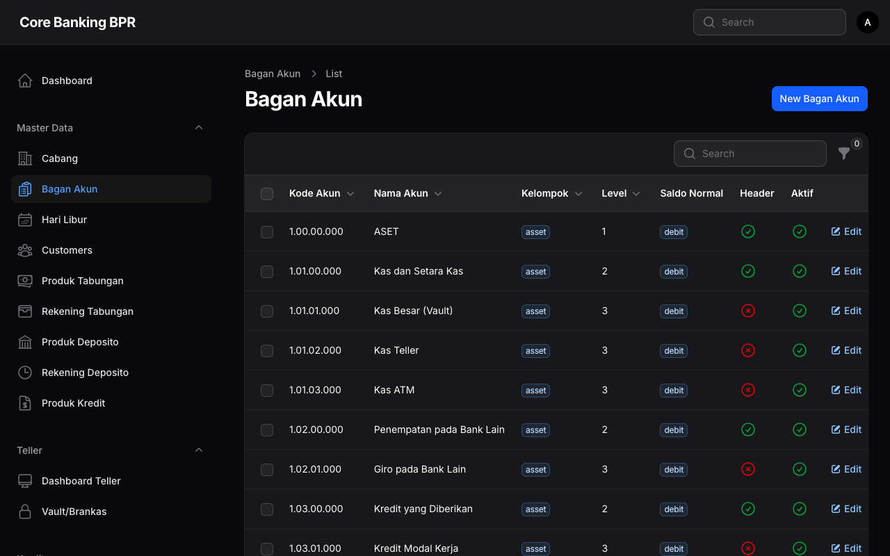
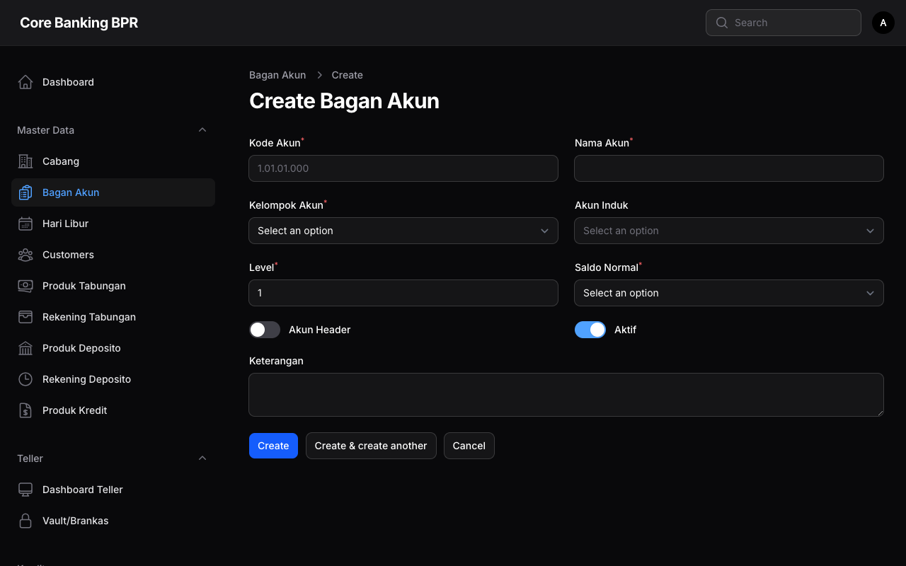

# Bagan Akun (Chart of Account)

Halaman ini menjelaskan fitur pengelolaan Bagan Akun (Chart of Account/CoA) pada sistem Core Banking BPR. Bagan Akun memiliki struktur hierarki hingga 4 level yang digunakan sebagai dasar pencatatan seluruh transaksi keuangan.

---

## Hak Akses

| Role           | Lihat | Tambah | Ubah | Hapus |
|----------------|:-----:|:------:|:----:|:-----:|
| SuperAdmin     | Ya    | Ya     | Ya   | Ya    |
| BranchManager  | Ya    | Tidak  | Tidak| Tidak |
| Auditor        | Ya    | Tidak  | Tidak| Tidak |
| Compliance     | Ya    | Tidak  | Tidak| Tidak |

!!! warning "Perhatian"
    Perubahan pada Bagan Akun akan berdampak langsung pada pencatatan transaksi dan laporan keuangan. Pastikan perubahan telah disetujui oleh pihak yang berwenang.

---

## Struktur Hierarki

Bagan Akun menggunakan struktur hierarki 4 level untuk mengelompokkan akun secara terstruktur:

| Level | Keterangan                  | Contoh              |
|:-----:|-----------------------------|----------------------|
| 1     | Kelompok Utama              | 1 - Aset             |
| 2     | Sub Kelompok                | 11 - Aset Lancar     |
| 3     | Golongan Akun               | 111 - Kas            |
| 4     | Akun Detail (Posting)       | 1111 - Kas Besar     |

!!! info "Informasi"
    Akun yang ditandai sebagai **Header** berfungsi sebagai pengelompokan dan tidak dapat digunakan untuk posting transaksi. Hanya akun non-header (level detail) yang dapat menerima jurnal.

---

## Daftar Bagan Akun

Halaman daftar menampilkan seluruh akun yang terdaftar dalam Bagan Akun beserta informasinya.

### Kolom Tabel

| Kolom          | Keterangan                                                        |
|----------------|-------------------------------------------------------------------|
| Kode Akun      | Kode numerik unik yang merepresentasikan akun                     |
| Nama Akun      | Nama deskriptif akun                                              |
| Kelompok Akun  | Klasifikasi akun ditampilkan sebagai badge (Aset, Liabilitas, dll) |
| Level          | Level hierarki akun (1-4)                                         |
| Saldo Normal   | Posisi saldo normal ditampilkan sebagai badge (Debit/Kredit)      |
| Header         | Menandakan apakah akun merupakan header pengelompokan              |
| Aktif          | Status aktif atau nonaktif akun                                   |

### Filter yang Tersedia

| Filter         | Keterangan                                                 |
|----------------|-------------------------------------------------------------|
| Kelompok Akun  | Filter berdasarkan klasifikasi: Aset, Liabilitas, Ekuitas, Pendapatan, Beban |
| Header         | Filter akun header atau akun detail                         |
| Aktif          | Filter berdasarkan status aktif/nonaktif                    |

!!! tip "Tips"
    Gunakan kombinasi filter **Kelompok Akun** dan **Header = Tidak** untuk melihat hanya akun-akun detail yang dapat digunakan untuk posting transaksi.

---

## Formulir Tambah / Ubah Bagan Akun

Formulir ini digunakan untuk menambahkan akun baru atau mengubah data akun yang sudah ada.

### Detail Field

| Field          | Tipe       | Wajib | Keterangan                                                  |
|----------------|------------|:-----:|--------------------------------------------------------------|
| Kode Akun      | Text       | Ya    | Kode numerik unik untuk akun                                 |
| Nama Akun      | Text       | Ya    | Nama deskriptif akun                                         |
| Kelompok Akun  | Select     | Ya    | Klasifikasi akun: Aset, Liabilitas, Ekuitas, Pendapatan, Beban |
| Parent         | Select     | Tidak | Akun induk dalam hierarki. Kosongkan untuk akun level 1      |
| Level          | Select     | Ya    | Level hierarki akun (1 sampai 4)                             |
| Saldo Normal   | Select     | Ya    | Posisi saldo normal: Debit atau Kredit                       |
| Header         | Toggle     | Tidak | Tandai jika akun ini merupakan header pengelompokan           |
| Aktif          | Toggle     | Tidak | Status aktif akun. Default: aktif                            |
| Deskripsi      | Textarea   | Tidak | Keterangan tambahan mengenai fungsi akun                     |

!!! info "Informasi"
    **Kelompok Akun** menentukan klasifikasi akun dalam laporan keuangan:

    - **Aset** — Harta atau kekayaan bank (saldo normal: Debit)
    - **Liabilitas** — Kewajiban atau hutang bank (saldo normal: Kredit)
    - **Ekuitas** — Modal pemilik bank (saldo normal: Kredit)
    - **Pendapatan** — Penghasilan bank (saldo normal: Kredit)
    - **Beban** — Biaya operasional bank (saldo normal: Debit)

---

## Panduan Langkah demi Langkah

### Menambah Akun Baru

1. Buka menu **Master Data > Bagan Akun**.
2. Klik tombol **Tambah Akun** di pojok kanan atas.
3. Isi **Kode Akun** dengan kode numerik unik sesuai struktur hierarki.
4. Isi **Nama Akun** dengan nama yang deskriptif.
5. Pilih **Kelompok Akun** yang sesuai (Aset/Liabilitas/Ekuitas/Pendapatan/Beban).
6. Pilih **Parent** jika akun ini merupakan sub-akun dari akun lain.
7. Tentukan **Level** hierarki sesuai posisi akun (1-4).
8. Pilih **Saldo Normal** yang sesuai (Debit/Kredit).
9. Aktifkan toggle **Header** jika akun ini hanya berfungsi sebagai pengelompokan.
10. Pastikan toggle **Aktif** dalam keadaan aktif.
11. Tambahkan **Deskripsi** jika diperlukan.
12. Klik tombol **Simpan** untuk menyimpan akun baru.

### Mengubah Data Akun

1. Buka menu **Master Data > Bagan Akun**.
2. Klik ikon **Edit** pada baris akun yang ingin diubah.
3. Ubah field yang diperlukan.
4. Klik tombol **Simpan** untuk menyimpan perubahan.

!!! warning "Perhatian"
    Jangan mengubah **Kelompok Akun** atau **Saldo Normal** pada akun yang sudah memiliki transaksi. Hal ini dapat menyebabkan ketidaksesuaian pada laporan keuangan.
