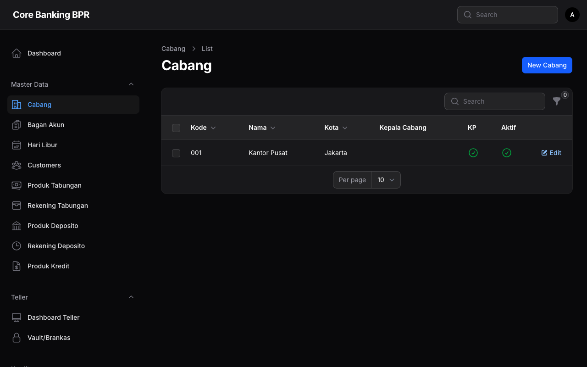
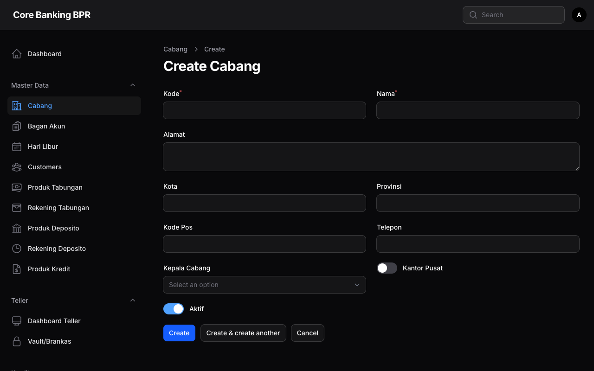

# Manajemen Cabang

Halaman ini menjelaskan fitur pengelolaan data cabang pada sistem Core Banking BPR. Setiap cabang merepresentasikan unit operasional bank yang memiliki kode unik, lokasi, dan kepala cabang.

---

## Hak Akses

| Role           | Lihat | Tambah | Ubah | Hapus |
|----------------|:-----:|:------:|:----:|:-----:|
| SuperAdmin     | Ya    | Ya     | Ya   | Ya    |
| BranchManager  | Ya    | Tidak  | Tidak| Tidak |

!!! warning "Perhatian"
    Hanya **SuperAdmin** yang dapat menambah, mengubah, atau menghapus data cabang. BranchManager hanya memiliki akses untuk melihat daftar cabang.

---

## Daftar Cabang

Halaman daftar cabang menampilkan seluruh cabang yang terdaftar dalam sistem beserta informasi utamanya.

### Kolom Tabel

| Kolom          | Keterangan                                      |
|----------------|--------------------------------------------------|
| Kode           | Kode unik cabang (3 karakter)                    |
| Nama           | Nama lengkap cabang                              |
| Kota           | Kota lokasi cabang                               |
| Kepala Cabang  | Nama pengguna yang ditunjuk sebagai kepala cabang |
| Kantor Pusat   | Menandakan apakah cabang merupakan kantor pusat   |
| Status Aktif   | Status aktif atau nonaktif cabang                 |

!!! tip "Tips"
    Gunakan fitur pencarian untuk menemukan cabang berdasarkan kode atau nama cabang secara cepat.

---

## Formulir Tambah / Ubah Cabang

Formulir ini digunakan untuk menambahkan cabang baru atau mengubah data cabang yang sudah ada.

### Detail Field

| Field          | Tipe       | Wajib | Keterangan                                                  |
|----------------|------------|:-----:|--------------------------------------------------------------|
| Kode           | Text       | Ya    | Kode unik cabang, maksimal 3 karakter. Tidak dapat diubah setelah disimpan. |
| Nama           | Text       | Ya    | Nama lengkap cabang                                          |
| Alamat         | Textarea   | Ya    | Alamat lengkap cabang                                        |
| Kota           | Text       | Ya    | Kota lokasi cabang                                           |
| Provinsi       | Text       | Ya    | Provinsi lokasi cabang                                       |
| Kode Pos       | Text       | Tidak | Kode pos alamat cabang                                       |
| Telepon        | Text       | Tidak | Nomor telepon cabang                                         |
| Kepala Cabang  | Select     | Tidak | Relasi ke pengguna yang ditunjuk sebagai kepala cabang        |
| Kantor Pusat   | Toggle     | Tidak | Tandai jika cabang ini merupakan kantor pusat                 |
| Aktif          | Toggle     | Tidak | Status aktif cabang. Default: aktif                          |

!!! info "Informasi"
    Field **Kode** bersifat unik dan hanya boleh terdiri dari 3 karakter. Pastikan kode yang dimasukkan belum digunakan oleh cabang lain.

---

## Panduan Langkah demi Langkah

### Menambah Cabang Baru

1. Buka menu **Master Data > Cabang**.
2. Klik tombol **Tambah Cabang** di pojok kanan atas.
3. Isi field **Kode** dengan kode unik 3 karakter (contoh: `001`, `KPS`).
4. Isi field **Nama** dengan nama lengkap cabang.
5. Lengkapi field **Alamat**, **Kota**, dan **Provinsi**.
6. Isi **Kode Pos** dan **Telepon** jika tersedia.
7. Pilih **Kepala Cabang** dari daftar pengguna yang tersedia.
8. Aktifkan toggle **Kantor Pusat** jika cabang ini merupakan kantor pusat.
9. Pastikan toggle **Aktif** dalam keadaan aktif.
10. Klik tombol **Simpan** untuk menyimpan data cabang.

### Mengubah Data Cabang

1. Buka menu **Master Data > Cabang**.
2. Klik ikon **Edit** pada baris cabang yang ingin diubah.
3. Ubah field yang diperlukan.
4. Klik tombol **Simpan** untuk menyimpan perubahan.

!!! warning "Perhatian"
    Menonaktifkan cabang akan memengaruhi akses pengguna yang terdaftar pada cabang tersebut. Pastikan untuk memindahkan pengguna terlebih dahulu sebelum menonaktifkan cabang.
