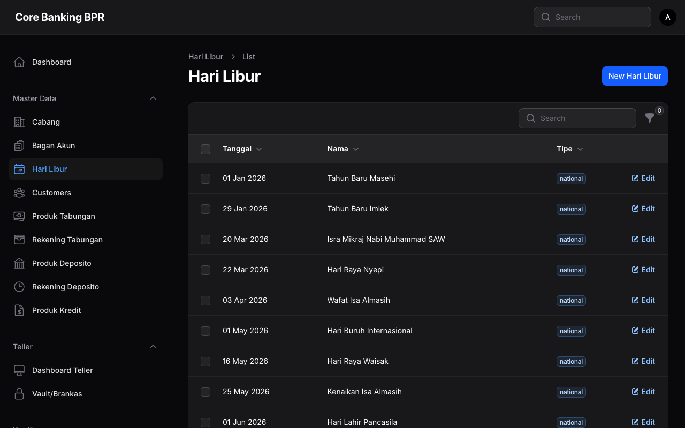

# Manajemen Hari Libur

Halaman ini menjelaskan fitur pengelolaan data hari libur pada sistem Core Banking BPR. Data hari libur digunakan oleh proses End of Day (EOD) untuk menentukan hari kerja dan melewatkan pemrosesan pada tanggal libur.

---

## Hak Akses

| Role           | Lihat | Tambah | Ubah | Hapus |
|----------------|:-----:|:------:|:----:|:-----:|
| SuperAdmin     | Ya    | Ya     | Ya   | Ya    |
| BranchManager  | Ya    | Tidak  | Tidak| Tidak |
| Auditor        | Ya    | Tidak  | Tidak| Tidak |

---

## Daftar Hari Libur

Halaman daftar menampilkan seluruh hari libur yang telah didaftarkan dalam sistem.

### Kolom Tabel

| Kolom   | Keterangan                                              |
|---------|----------------------------------------------------------|
| Tanggal | Tanggal hari libur                                       |
| Nama    | Nama atau keterangan hari libur                          |
| Tipe    | Klasifikasi hari libur: Nasional, Keagamaan, Perusahaan  |

### Filter yang Tersedia

| Filter | Keterangan                                                          |
|--------|----------------------------------------------------------------------|
| Tipe   | Filter berdasarkan tipe hari libur: Nasional, Keagamaan, Perusahaan  |

!!! info "Informasi"
    Tipe hari libur membantu mengklasifikasikan alasan libur:

    - **Nasional** — Hari libur nasional yang ditetapkan pemerintah (contoh: Hari Kemerdekaan, Tahun Baru)
    - **Keagamaan** — Hari besar keagamaan (contoh: Idul Fitri, Natal, Nyepi)
    - **Perusahaan** — Hari libur khusus yang ditetapkan oleh manajemen bank (contoh: HUT Perusahaan, Cuti Bersama)

---

## Formulir Tambah / Ubah Hari Libur

Formulir ini digunakan untuk menambahkan hari libur baru atau mengubah data hari libur yang sudah ada.

### Detail Field

| Field   | Tipe        | Wajib | Keterangan                                                    |
|---------|-------------|:-----:|----------------------------------------------------------------|
| Tanggal | Date Picker | Ya    | Tanggal hari libur. Setiap tanggal hanya boleh didaftarkan satu kali. |
| Nama    | Text        | Ya    | Nama atau keterangan hari libur                                |
| Tipe    | Select      | Ya    | Tipe hari libur: Nasional, Keagamaan, atau Perusahaan          |

!!! warning "Perhatian"
    Field **Tanggal** bersifat unik. Sistem tidak mengizinkan pendaftaran dua hari libur pada tanggal yang sama.

---

## Hubungan dengan Proses EOD

Data hari libur memiliki peran penting dalam proses End of Day (EOD) sistem:

- **Perhitungan Bunga** — Proses EOD akan melewatkan perhitungan bunga pada hari libur sesuai konfigurasi produk.
- **Jatuh Tempo** — Sistem akan menyesuaikan tanggal jatuh tempo yang bertepatan dengan hari libur ke hari kerja berikutnya.
- **Pelaporan** — Hari libur diperhitungkan dalam kalkulasi hari kerja efektif untuk keperluan pelaporan.

!!! tip "Tips"
    Disarankan untuk mendaftarkan seluruh hari libur di awal tahun agar proses EOD berjalan dengan benar sepanjang tahun. Hari libur dapat ditambahkan kapan saja, namun pastikan didaftarkan sebelum tanggal libur tersebut tiba.

---

## Panduan Langkah demi Langkah

### Menambah Hari Libur Baru

1. Buka menu **Master Data > Hari Libur**.
2. Klik tombol **Tambah Hari Libur** di pojok kanan atas.
3. Pilih **Tanggal** hari libur menggunakan date picker.
4. Isi **Nama** hari libur (contoh: "Hari Kemerdekaan RI").
5. Pilih **Tipe** hari libur yang sesuai (Nasional/Keagamaan/Perusahaan).
6. Klik tombol **Simpan** untuk menyimpan data hari libur.

### Menambah Hari Libur Massal

1. Untuk mendaftarkan banyak hari libur sekaligus, tambahkan satu per satu melalui formulir.
2. Pastikan tidak ada tanggal yang duplikat.
3. Verifikasi kembali daftar hari libur setelah selesai untuk memastikan kelengkapan data.

!!! info "Informasi"
    Perubahan data hari libur hanya berlaku untuk proses yang belum dijalankan. Jika proses EOD sudah berjalan pada tanggal tertentu, penambahan hari libur pada tanggal tersebut tidak akan memengaruhi hasil yang sudah diproses.
