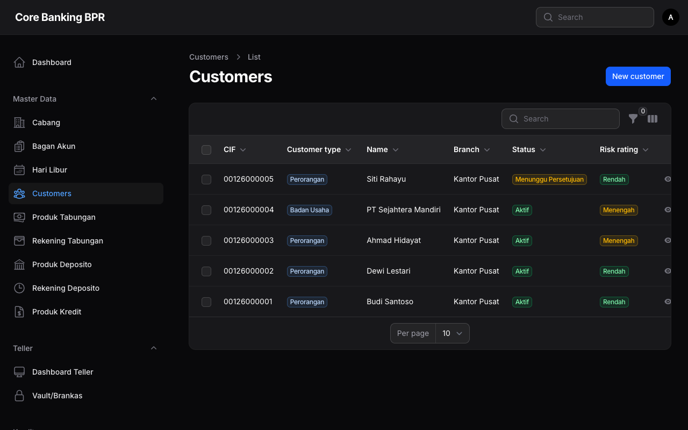
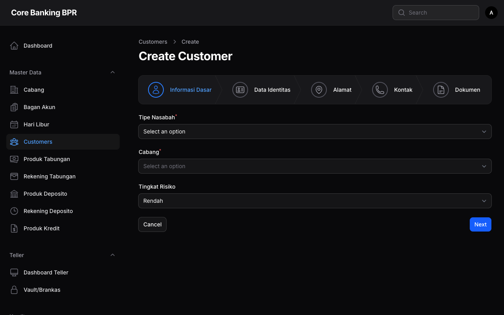
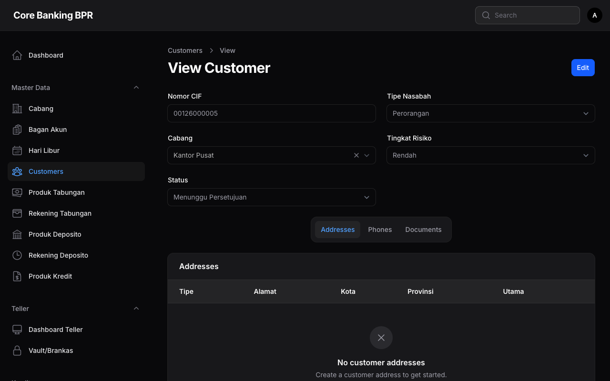

# Manajemen Nasabah

Halaman ini menjelaskan fitur pengelolaan data nasabah pada sistem Core Banking BPR. Sistem mendukung dua tipe nasabah: **Perorangan** (Individual) dan **Badan Usaha** (Corporate). Setiap nasabah memiliki Nomor CIF (Customer Information File) yang unik sebagai identitas utama.

---

## Hak Akses

| Role           | Lihat          | Tambah | Ubah | Hapus |
|----------------|:--------------:|:------:|:----:|:-----:|
| SuperAdmin     | Semua cabang   | Ya     | Ya   | Ya    |
| Auditor        | Semua cabang   | Tidak  | Tidak| Tidak |
| Compliance     | Semua cabang   | Tidak  | Tidak| Tidak |
| BranchManager  | Semua cabang   | Ya     | Ya   | Tidak |
| Teller         | Cabang sendiri | Tidak  | Tidak| Tidak |
| CustomerService| Cabang sendiri | Ya     | Ya   | Tidak |

!!! info "Informasi"
    Pengguna dengan role **SuperAdmin**, **Auditor**, **Compliance**, dan **BranchManager** dapat melihat data nasabah dari seluruh cabang. Role lainnya hanya dapat melihat nasabah yang terdaftar pada cabang mereka sendiri.

---

## Daftar Nasabah

Halaman daftar menampilkan seluruh nasabah yang terdaftar dalam sistem sesuai dengan hak akses pengguna.

### Kolom Tabel

| Kolom           | Keterangan                                                        |
|-----------------|-------------------------------------------------------------------|
| Nomor CIF       | Nomor identitas unik nasabah. Dapat dicari dan disalin.           |
| Tipe Nasabah    | Klasifikasi nasabah ditampilkan sebagai badge (Perorangan/Badan Usaha) |
| Nama            | Nama lengkap nasabah atau nama badan usaha                        |
| Cabang          | Cabang tempat nasabah terdaftar                                   |
| Status          | Status nasabah ditampilkan sebagai badge (Active/Inactive/Blocked) |
| Risk Rating     | Tingkat risiko nasabah ditampilkan sebagai badge                   |
| Tanggal Dibuat  | Tanggal pendaftaran nasabah                                       |

### Filter yang Tersedia

| Filter        | Keterangan                                               |
|---------------|-----------------------------------------------------------|
| Tipe Nasabah  | Filter berdasarkan tipe: Perorangan atau Badan Usaha      |
| Status        | Filter berdasarkan status: Active, Inactive, Blocked      |
| Risk Rating   | Filter berdasarkan tingkat risiko nasabah                  |
| Cabang        | Filter berdasarkan cabang tempat nasabah terdaftar         |

!!! tip "Tips"
    Gunakan fitur pencarian pada kolom **Nomor CIF** untuk menemukan nasabah dengan cepat. Klik ikon salin untuk menyalin nomor CIF ke clipboard.

---

## Status Nasabah

Sistem mengelola tiga status nasabah:

| Status    | Keterangan                                                              |
|-----------|--------------------------------------------------------------------------|
| Active    | Nasabah aktif dan dapat melakukan transaksi                              |
| Inactive  | Nasabah tidak aktif. Tidak dapat melakukan transaksi baru.               |
| Blocked   | Nasabah diblokir karena alasan kepatuhan atau keamanan. Seluruh transaksi ditangguhkan. |

!!! warning "Perhatian"
    Perubahan status nasabah ke **Blocked** akan menangguhkan seluruh transaksi termasuk rekening tabungan dan deposito. Pastikan tindakan ini telah melalui prosedur yang berlaku.

---

## Formulir Tambah / Ubah Nasabah

Formulir ini digunakan untuk menambahkan nasabah baru atau mengubah data nasabah yang sudah ada.

### Detail Field

| Field          | Tipe       | Wajib | Keterangan                                                  |
|----------------|------------|:-----:|--------------------------------------------------------------|
| Nomor CIF      | Text       | -     | Dihasilkan otomatis oleh sistem. Tidak dapat diubah.          |
| Tipe Nasabah   | Select     | Ya    | Perorangan atau Badan Usaha. Tidak dapat diubah setelah disimpan. |
| Cabang         | Select     | Ya    | Cabang tempat nasabah terdaftar                               |
| Risk Rating    | Select     | Ya    | Tingkat risiko nasabah berdasarkan penilaian KYC               |
| Status         | Badge      | -     | Diatur oleh sistem. Tidak dapat diubah secara langsung.        |

!!! info "Informasi"
    **Nomor CIF** dihasilkan secara otomatis oleh sistem dan bersifat permanen. Field **Tipe Nasabah** juga tidak dapat diubah setelah data nasabah disimpan untuk menjaga integritas data.

---

## Detail Nasabah

Halaman detail nasabah menampilkan informasi lengkap beserta data relasi yang terkait.

### Relation Manager

Halaman detail nasabah memiliki 3 tab relasi untuk mengelola data tambahan:

#### 1. Alamat

Mengelola daftar alamat nasabah (rumah, kantor, domisili, dll).

| Field    | Keterangan                           |
|----------|---------------------------------------|
| Tipe     | Jenis alamat (Rumah, Kantor, Lainnya) |
| Alamat   | Alamat lengkap                        |
| Kota     | Kota                                  |
| Provinsi | Provinsi                              |
| Kode Pos | Kode pos                              |
| Utama    | Tandai sebagai alamat utama           |

#### 2. Telepon

Mengelola daftar nomor telepon nasabah.

| Field  | Keterangan                                   |
|--------|-----------------------------------------------|
| Tipe   | Jenis telepon (HP, Rumah, Kantor, Lainnya)    |
| Nomor  | Nomor telepon                                 |
| Utama  | Tandai sebagai nomor utama                    |

#### 3. Dokumen

Mengelola dokumen identitas dan pendukung nasabah.

| Field          | Keterangan                                |
|----------------|-------------------------------------------|
| Tipe Dokumen   | Jenis dokumen (KTP, NPWP, SIM, Paspor, Akta, SIUP, dll) |
| Nomor Dokumen  | Nomor identitas pada dokumen              |
| Tanggal Terbit | Tanggal penerbitan dokumen                |
| Tanggal Expired| Tanggal kadaluarsa dokumen                |
| File           | Upload file dokumen                       |

---

## Panduan Langkah demi Langkah

### Menambah Nasabah Perorangan

1. Buka menu **Master Data > Nasabah**.
2. Klik tombol **Tambah Nasabah** di pojok kanan atas.
3. Pilih **Tipe Nasabah** sebagai **Perorangan**.
4. Pilih **Cabang** tempat nasabah akan didaftarkan.
5. Tentukan **Risk Rating** berdasarkan hasil penilaian KYC.
6. Klik tombol **Simpan** untuk menyimpan data nasabah.
7. Sistem akan menghasilkan **Nomor CIF** secara otomatis.
8. Lanjutkan ke halaman detail untuk menambahkan **Alamat**, **Telepon**, dan **Dokumen**.

### Menambah Nasabah Badan Usaha

1. Buka menu **Master Data > Nasabah**.
2. Klik tombol **Tambah Nasabah** di pojok kanan atas.
3. Pilih **Tipe Nasabah** sebagai **Badan Usaha**.
4. Pilih **Cabang** tempat nasabah akan didaftarkan.
5. Tentukan **Risk Rating** berdasarkan hasil penilaian KYC.
6. Klik tombol **Simpan** untuk menyimpan data nasabah.
7. Lanjutkan ke halaman detail untuk melengkapi data **Alamat**, **Telepon**, dan **Dokumen** (SIUP, Akta Pendirian, dll).

### Mengelola Data Relasi Nasabah

1. Buka halaman detail nasabah yang diinginkan.
2. Pilih tab **Alamat**, **Telepon**, atau **Dokumen**.
3. Klik tombol **Tambah** pada tab yang dipilih.
4. Isi formulir yang tersedia.
5. Klik tombol **Simpan** untuk menyimpan data.

!!! tip "Tips"
    Pastikan setiap nasabah memiliki minimal satu alamat utama, satu nomor telepon utama, dan dokumen identitas (KTP untuk perorangan, SIUP untuk badan usaha) sebelum membuka rekening.
