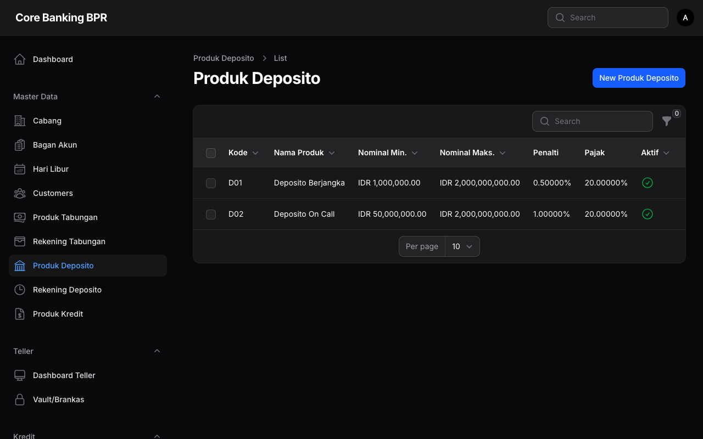

# Produk Deposito

Halaman **Produk Deposito** digunakan untuk mengelola konfigurasi produk deposito berjangka yang ditawarkan oleh bank. Setiap produk deposito memiliki pengaturan jumlah, denda, pajak, serta mapping akun General Ledger (GL).

## Hak Akses

| Role | Lihat | Tambah | Ubah | Hapus |
|------|:-----:|:------:|:----:|:-----:|
| Super Admin | ✅ | ✅ | ✅ | ✅ |
| Admin Cabang | ✅ | ❌ | ❌ | ❌ |
| Teller | ✅ | ❌ | ❌ | ❌ |
| Customer Service | ✅ | ❌ | ❌ | ❌ |
| Viewer | ✅ | ❌ | ❌ | ❌ |

!!! info "Informasi"
    Hanya Super Admin yang dapat menambah, mengubah, atau menghapus produk deposito. Role lainnya hanya memiliki akses untuk melihat data produk.

---

## Daftar Produk Deposito

Halaman daftar menampilkan seluruh produk deposito yang tersedia dengan kolom-kolom berikut:

| Kolom | Keterangan |
|-------|------------|
| **Kode** | Kode unik produk deposito. |
| **Nama** | Nama produk deposito. |
| **Jumlah Minimum** | Nominal minimum penempatan deposito dalam Rupiah. |
| **Jumlah Maksimum** | Nominal maksimum penempatan deposito dalam Rupiah. |
| **Denda Rate** | Persentase denda yang dikenakan jika deposito dicairkan sebelum jatuh tempo. |
| **Tarif Pajak** | Persentase pajak yang dikenakan atas bunga deposito. |
| **Aktif** | Menunjukkan apakah produk masih aktif dan dapat digunakan untuk pembukaan deposito baru. |

---

## Formulir Produk Deposito

Formulir produk deposito terbagi menjadi beberapa bagian (section) untuk memudahkan pengisian data.

### Section 1: Info Produk

| Field | Tipe | Keterangan |
|-------|------|------------|
| **Kode** | Text | Kode unik produk deposito. Harus bersifat unik di seluruh sistem. |
| **Nama** | Text | Nama lengkap produk deposito yang akan ditampilkan kepada nasabah. |
| **Deskripsi** | Textarea | Penjelasan detail mengenai produk deposito. |
| **Mata Uang** | Select | Mata uang yang digunakan untuk produk ini (misalnya IDR). |
| **Aktif** | Toggle | Status aktif produk. Produk yang tidak aktif tidak dapat digunakan untuk pembukaan deposito baru. |

### Section 2: Persyaratan Jumlah

| Field | Tipe | Keterangan |
|-------|------|------------|
| **Jumlah Minimum** | Numeric | Nominal minimum penempatan deposito. Nasabah tidak dapat membuka deposito di bawah nilai ini. |
| **Jumlah Maksimum** | Numeric | Nominal maksimum penempatan deposito. Nasabah tidak dapat membuka deposito di atas nilai ini. |

!!! warning "Validasi"
    Jumlah Minimum harus lebih kecil dari Jumlah Maksimum. Sistem akan menolak penyimpanan jika validasi ini tidak terpenuhi.

### Section 3: Denda & Pajak

| Field | Tipe | Keterangan |
|-------|------|------------|
| **Denda Rate** | Numeric (%) | Persentase denda pencairan sebelum jatuh tempo. Dihitung dari nominal pokok deposito. |
| **Tarif Pajak** | Numeric (%) | Persentase pajak atas bunga deposito sesuai ketentuan perpajakan yang berlaku. |
| **Threshold Pajak** | Numeric | Batas nominal pokok deposito yang dikenakan pajak. Deposito di bawah threshold ini tidak dikenakan pajak bunga. |

!!! note "Ketentuan Pajak"
    Sesuai regulasi yang berlaku, bunga deposito dengan pokok di bawah threshold tertentu (umumnya Rp 7.500.000) tidak dikenakan pajak penghasilan.

### Section 4: Mapping GL

| Field | Tipe | Keterangan |
|-------|------|------------|
| **GL Deposito** | Select (COA) | Akun GL untuk pencatatan pokok deposito pada sisi liabilitas. |
| **GL Beban Bunga** | Select (COA) | Akun GL untuk pencatatan beban bunga deposito. |
| **GL Bunga Yang Masih Harus Dibayar** | Select (COA) | Akun GL untuk pencatatan bunga yang telah diakui namun belum dibayarkan (accrued interest payable). |
| **GL Pajak** | Select (COA) | Akun GL untuk pencatatan kewajiban pajak atas bunga deposito. |

!!! tip "Tips"
    Pastikan mapping GL sudah sesuai dengan Chart of Account (COA) yang berlaku di bank. Kesalahan mapping GL dapat menyebabkan laporan keuangan tidak akurat.

---

## Relation Manager: Rates

Setiap produk deposito memiliki daftar **suku bunga bertingkat (tiered interest rates)** berdasarkan tenor penempatan.

| Kolom | Keterangan |
|-------|------------|
| **Tenor (Bulan)** | Jangka waktu penempatan deposito dalam satuan bulan. |
| **Suku Bunga (%)** | Persentase suku bunga per tahun yang diberikan untuk tenor tersebut. |
| **Jumlah Minimum** | Batas minimum nominal pokok untuk mendapatkan suku bunga ini. |
| **Jumlah Maksimum** | Batas maksimum nominal pokok untuk suku bunga ini. |

!!! example "Contoh Tiered Rates"
    | Tenor | Suku Bunga | Jumlah Min | Jumlah Max |
    |-------|:----------:|:----------:|:----------:|
    | 1 bulan | 3,50% | Rp 10.000.000 | Rp 100.000.000 |
    | 3 bulan | 4,00% | Rp 10.000.000 | Rp 100.000.000 |
    | 6 bulan | 4,50% | Rp 10.000.000 | Rp 500.000.000 |
    | 12 bulan | 5,00% | Rp 10.000.000 | Rp 1.000.000.000 |

---

## Panduan Operasional

### Menambah Produk Deposito Baru

1. Klik tombol **Tambah Produk Deposito** pada halaman daftar.
2. Isi **Info Produk** — kode, nama, deskripsi, mata uang, dan status aktif.
3. Isi **Persyaratan Jumlah** — tentukan jumlah minimum dan maksimum penempatan.
4. Isi **Denda & Pajak** — tentukan denda rate, tarif pajak, dan threshold pajak.
5. Isi **Mapping GL** — pilih akun GL yang sesuai untuk setiap kategori.
6. Klik **Simpan** untuk menyimpan produk baru.
7. Setelah produk tersimpan, tambahkan **Rates** melalui Relation Manager.

### Menambah Suku Bunga (Rates)

1. Buka halaman **Detail Produk Deposito**.
2. Gulir ke bagian **Rates** pada Relation Manager.
3. Klik tombol **Tambah Rate**.
4. Isi tenor, suku bunga, jumlah minimum, dan jumlah maksimum.
5. Klik **Simpan**.

### Menonaktifkan Produk Deposito

1. Buka halaman **Edit Produk Deposito**.
2. Matikan toggle **Aktif**.
3. Klik **Simpan**.

!!! warning "Perhatian"
    Menonaktifkan produk deposito tidak mempengaruhi deposito yang sudah berjalan. Deposito yang sudah dibuka dengan produk ini akan tetap berjalan hingga jatuh tempo. Produk yang dinonaktifkan hanya tidak akan muncul sebagai pilihan saat pembukaan deposito baru.
