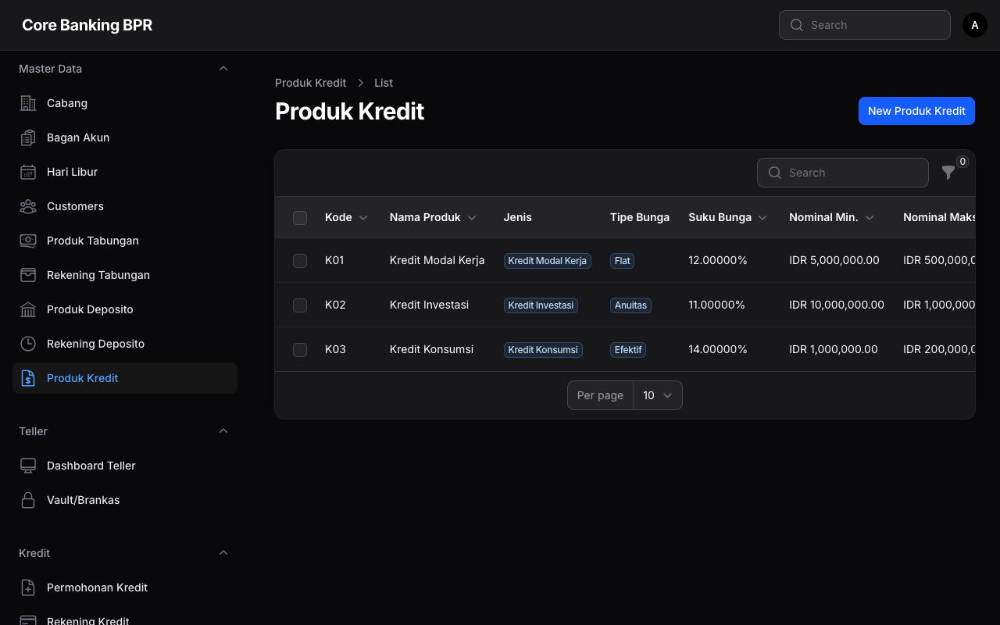
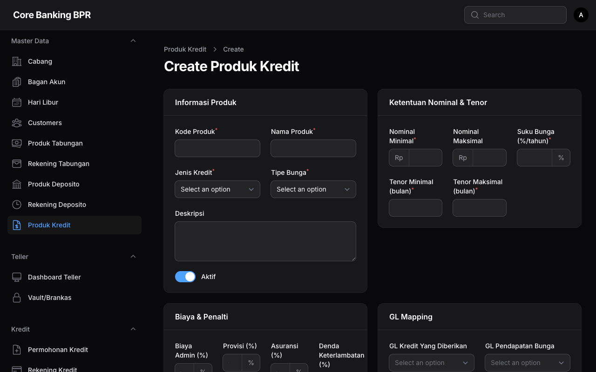

# Produk Kredit

Halaman **Produk Kredit** digunakan untuk mengelola konfigurasi produk pinjaman/kredit yang ditawarkan oleh bank. Setiap produk kredit memiliki pengaturan jenis kredit, tipe bunga, batas jumlah dan tenor, biaya-biaya, serta mapping akun General Ledger (GL).

## Hak Akses

| Role | Lihat | Tambah | Ubah | Hapus |
|------|:-----:|:------:|:----:|:-----:|
| Super Admin | ✅ | ✅ | ✅ | ✅ |
| Admin Cabang | ✅ | ❌ | ❌ | ❌ |
| Teller | ✅ | ❌ | ❌ | ❌ |
| Customer Service | ✅ | ❌ | ❌ | ❌ |
| Viewer | ✅ | ❌ | ❌ | ❌ |

!!! info "Informasi"
    Hanya Super Admin yang dapat menambah, mengubah, atau menghapus produk kredit. Role lainnya hanya memiliki akses untuk melihat data produk.

---

## Daftar Produk Kredit

Halaman daftar menampilkan seluruh produk kredit yang tersedia dengan kolom-kolom berikut:

| Kolom | Keterangan |
|-------|------------|
| **Kode** | Kode unik produk kredit. |
| **Nama** | Nama produk kredit. |
| **Jenis Kredit** | Kategori jenis kredit, ditampilkan dalam bentuk badge. |
| **Tipe Bunga** | Tipe perhitungan bunga, ditampilkan dalam bentuk badge. |
| **Suku Bunga** | Persentase suku bunga per tahun. |
| **Jumlah Min** | Nominal minimum pinjaman dalam Rupiah. |
| **Jumlah Max** | Nominal maksimum pinjaman dalam Rupiah. |
| **Aktif** | Menunjukkan apakah produk masih aktif dan dapat digunakan untuk pengajuan kredit baru. |

### Jenis Kredit

| Jenis | Keterangan |
|-------|------------|
| **Kredit Modal Kerja** | Kredit untuk membiayai kebutuhan modal kerja usaha. |
| **Kredit Investasi** | Kredit untuk membiayai pembelian aset atau investasi usaha. |
| **Kredit Konsumsi** | Kredit untuk membiayai kebutuhan konsumtif nasabah. |
| **Kredit Multiguna** | Kredit serbaguna yang dapat digunakan untuk berbagai keperluan. |

### Tipe Bunga

| Tipe | Keterangan |
|------|------------|
| **Flat** | Bunga dihitung dari pokok awal pinjaman dan tetap sepanjang tenor. Angsuran bulanan tetap sama. |
| **Efektif (Annuity)** | Bunga dihitung dari sisa pokok pinjaman. Angsuran tetap, tetapi proporsi bunga dan pokok berubah setiap bulan. |
| **Sliding** | Bunga dihitung dari sisa pokok pinjaman. Angsuran menurun seiring berkurangnya pokok pinjaman. |

### Filter yang Tersedia

- **Jenis Kredit** — Filter berdasarkan kategori jenis kredit.
- **Tipe Bunga** — Filter berdasarkan metode perhitungan bunga.
- **Aktif** — Filter berdasarkan status aktif produk.

---

## Formulir Produk Kredit

Formulir produk kredit terbagi menjadi beberapa bagian (section) untuk memudahkan pengisian data.

### Section 1: Info Produk

| Field | Tipe | Keterangan |
|-------|------|------------|
| **Kode** | Text | Kode unik produk kredit. Harus bersifat unik di seluruh sistem. |
| **Nama** | Text | Nama lengkap produk kredit. |
| **Jenis Kredit** | Select (Enum) | Kategori jenis kredit: Modal Kerja, Investasi, Konsumsi, atau Multiguna. |
| **Tipe Bunga** | Select (Enum) | Metode perhitungan bunga: Flat, Efektif (Annuity), atau Sliding. |
| **Deskripsi** | Textarea | Penjelasan detail mengenai produk kredit. |
| **Aktif** | Toggle | Status aktif produk. Produk yang tidak aktif tidak akan muncul sebagai pilihan saat pengajuan kredit baru. |

### Section 2: Jumlah & Tenor

| Field | Tipe | Keterangan |
|-------|------|------------|
| **Jumlah Min** | Numeric | Nominal minimum pinjaman yang dapat diajukan. |
| **Jumlah Max** | Numeric | Nominal maksimum pinjaman yang dapat diajukan. |
| **Suku Bunga** | Numeric (%) | Persentase suku bunga per tahun. |
| **Tenor Min (Bulan)** | Numeric | Jangka waktu minimum pinjaman dalam satuan bulan. |
| **Tenor Max (Bulan)** | Numeric | Jangka waktu maksimum pinjaman dalam satuan bulan. |

!!! warning "Validasi"
    - Jumlah Min harus lebih kecil dari Jumlah Max.
    - Tenor Min harus lebih kecil dari Tenor Max.
    - Suku Bunga harus bernilai positif.
    Sistem akan menolak penyimpanan jika validasi ini tidak terpenuhi.

### Section 3: Biaya & Denda

| Field | Tipe | Keterangan |
|-------|------|------------|
| **Admin Fee Rate** | Numeric (%) | Persentase biaya administrasi yang dikenakan saat pencairan kredit. Dihitung dari nominal pinjaman yang disetujui. |
| **Provision Fee Rate** | Numeric (%) | Persentase biaya provisi yang dikenakan saat pencairan. Biasanya dicatat sebagai pendapatan ditangguhkan dan diamortisasi selama tenor kredit. |
| **Insurance Rate** | Numeric (%) | Persentase biaya asuransi kredit. Dihitung dari nominal pinjaman dan tenor. |
| **Penalty Rate** | Numeric (%) | Persentase denda keterlambatan pembayaran angsuran. Dihitung dari jumlah angsuran yang tertunggak. |

!!! note "Catatan"
    Biaya administrasi dan provisi umumnya dipotong langsung dari dana pencairan kredit. Pastikan nasabah telah diinformasikan mengenai rincian biaya sebelum proses pencairan.

### Section 4: Mapping GL

| Field | Tipe | Keterangan |
|-------|------|------------|
| **GL Kredit** | Select (COA) | Akun GL untuk pencatatan pokok pinjaman pada sisi aset. |
| **GL Pendapatan Bunga** | Select (COA) | Akun GL untuk pencatatan pendapatan bunga kredit yang telah diterima. |
| **GL Bunga Yang Masih Harus Diterima** | Select (COA) | Akun GL untuk pencatatan bunga yang telah diakui namun belum diterima pembayarannya (accrued interest receivable). |
| **GL Pendapatan Fee** | Select (COA) | Akun GL untuk pencatatan pendapatan dari biaya administrasi dan fee lainnya. |
| **GL Provisi** | Select (COA) | Akun GL untuk pencatatan pendapatan provisi. Dapat berupa pendapatan ditangguhkan yang diamortisasi. |

!!! tip "Tips"
    Pastikan mapping GL sudah sesuai dengan Chart of Account (COA) dan standar akuntansi perbankan yang berlaku (PSAK/PAPI). Kesalahan mapping GL akan berdampak pada laporan keuangan dan pelaporan ke OJK.

---

## Panduan Operasional

### Menambah Produk Kredit Baru

1. Klik tombol **Tambah Produk Kredit** pada halaman daftar.
2. Isi **Info Produk** — kode, nama, jenis kredit, tipe bunga, deskripsi, dan status aktif.
3. Isi **Jumlah & Tenor** — tentukan batas jumlah pinjaman, suku bunga, dan batas tenor.
4. Isi **Biaya & Denda** — tentukan persentase biaya administrasi, provisi, asuransi, dan denda.
5. Isi **Mapping GL** — pilih akun GL yang sesuai untuk setiap kategori.
6. Klik **Simpan** untuk menyimpan produk baru.

### Mengubah Suku Bunga Produk

1. Buka halaman **Edit Produk Kredit**.
2. Ubah nilai **Suku Bunga** pada section Jumlah & Tenor.
3. Klik **Simpan**.

!!! warning "Perhatian"
    Perubahan suku bunga pada produk kredit hanya berlaku untuk kredit baru yang diajukan setelah perubahan. Kredit yang sudah berjalan tetap menggunakan suku bunga yang telah disepakati pada saat pencairan, kecuali untuk produk dengan tipe bunga mengambang (floating rate).

### Menonaktifkan Produk Kredit

1. Buka halaman **Edit Produk Kredit**.
2. Matikan toggle **Aktif**.
3. Klik **Simpan**.

!!! warning "Perhatian"
    Menonaktifkan produk kredit tidak mempengaruhi kredit yang sudah berjalan. Kredit yang sudah dicairkan dengan produk ini akan tetap berjalan hingga lunas. Produk yang dinonaktifkan hanya tidak akan muncul sebagai pilihan saat pengajuan kredit baru.

### Memilih Tipe Bunga yang Tepat

!!! example "Perbandingan Simulasi (Pinjaman Rp 12.000.000, Bunga 12% p.a., Tenor 12 Bulan)"

    **Flat:**

    - Angsuran per bulan: Rp 1.120.000 (tetap)
    - Total bunga: Rp 1.440.000

    **Efektif (Annuity):**

    - Angsuran per bulan: Rp 1.066.185 (tetap)
    - Total bunga: Rp 794.217

    **Sliding:**

    - Angsuran bulan ke-1: Rp 1.120.000, bulan ke-12: Rp 1.010.000 (menurun)
    - Total bunga: Rp 780.000
