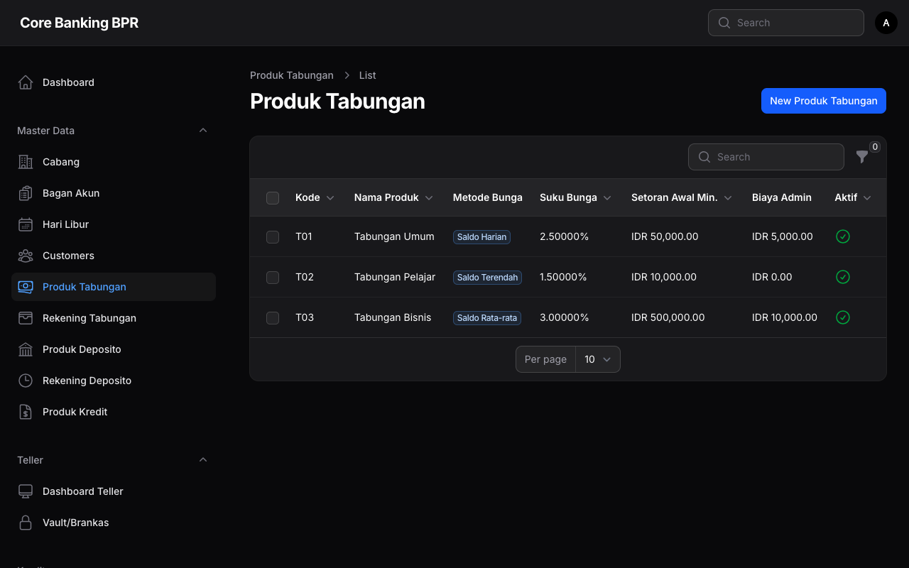
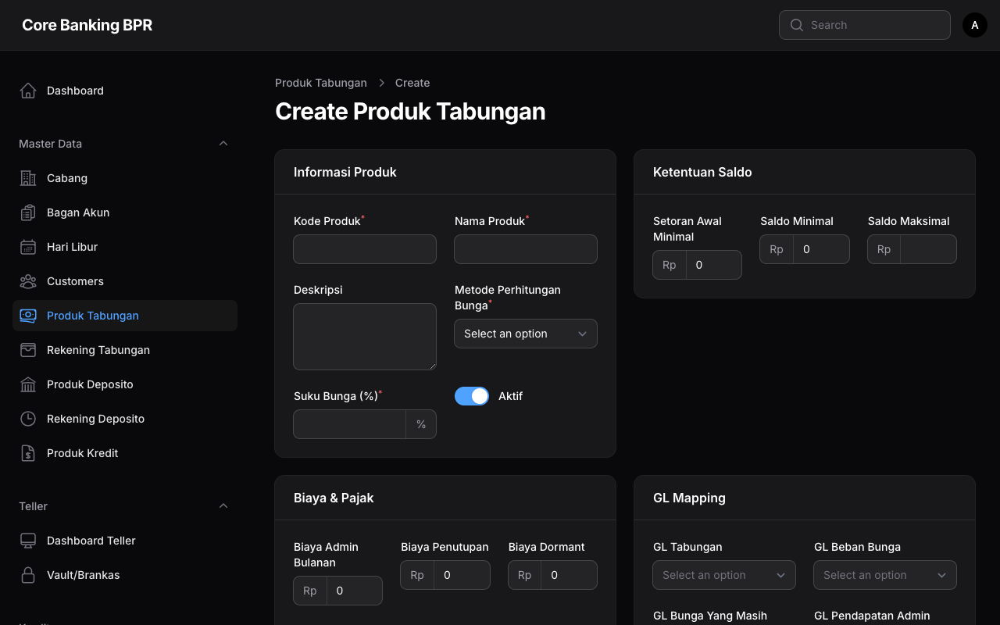

# Produk Tabungan

Halaman ini menjelaskan fitur pengelolaan produk tabungan pada sistem Core Banking BPR. Produk tabungan mendefinisikan parameter dan ketentuan yang berlaku untuk setiap rekening tabungan yang dibuka oleh nasabah.

---

## Hak Akses

| Role           | Lihat | Tambah | Ubah | Hapus |
|----------------|:-----:|:------:|:----:|:-----:|
| SuperAdmin     | Ya    | Ya     | Ya   | Ya    |
| BranchManager  | Ya    | Tidak  | Tidak| Tidak |
| Auditor        | Ya    | Tidak  | Tidak| Tidak |
| Compliance     | Ya    | Tidak  | Tidak| Tidak |

!!! warning "Perhatian"
    Hanya **SuperAdmin** yang dapat menambah, mengubah, atau menghapus produk tabungan. Perubahan pada produk tabungan akan berdampak pada seluruh rekening yang menggunakan produk tersebut.

---

## Daftar Produk Tabungan

Halaman daftar menampilkan seluruh produk tabungan yang tersedia dalam sistem.

### Kolom Tabel

| Kolom                        | Keterangan                                                    |
|------------------------------|----------------------------------------------------------------|
| Kode                         | Kode unik produk tabungan                                      |
| Nama                         | Nama produk tabungan                                           |
| Metode Perhitungan Bunga     | Metode yang digunakan untuk menghitung bunga, ditampilkan sebagai badge |
| Suku Bunga                   | Persentase suku bunga tahunan                                  |
| Setoran Awal Minimum         | Jumlah minimal setoran awal untuk membuka rekening              |
| Biaya Admin Bulanan          | Biaya administrasi yang dibebankan setiap bulan                 |
| Aktif                        | Status aktif atau nonaktif produk                               |

!!! tip "Tips"
    Produk yang dinonaktifkan tidak akan tersedia untuk pembukaan rekening baru, namun rekening yang sudah ada tetap akan berjalan sesuai ketentuan produk.

---

## Formulir Tambah / Ubah Produk Tabungan

Formulir ini terdiri dari beberapa bagian (section) untuk mengelola seluruh parameter produk tabungan.

### Bagian 1: Info Produk

| Field                       | Tipe       | Wajib | Keterangan                                              |
|-----------------------------|------------|:-----:|----------------------------------------------------------|
| Kode                        | Text       | Ya    | Kode unik produk. Tidak dapat diubah setelah disimpan.    |
| Nama                        | Text       | Ya    | Nama produk tabungan                                      |
| Deskripsi                   | Textarea   | Tidak | Keterangan detail mengenai produk                         |
| Metode Perhitungan Bunga    | Select     | Ya    | Metode kalkulasi bunga yang akan digunakan                 |
| Suku Bunga                  | Number     | Ya    | Persentase suku bunga tahunan (contoh: 3.5)                |
| Aktif                       | Toggle     | Tidak | Status aktif produk. Default: aktif                       |

!!! info "Informasi"
    **Metode Perhitungan Bunga** menentukan cara sistem menghitung bunga harian. Pastikan metode yang dipilih sesuai dengan kebijakan bank dan ketentuan regulator.

### Bagian 2: Persyaratan Saldo

| Field                  | Tipe    | Wajib | Keterangan                                                     |
|------------------------|---------|:-----:|-----------------------------------------------------------------|
| Setoran Awal Minimum   | Number  | Ya    | Jumlah minimal setoran pertama saat pembukaan rekening           |
| Saldo Minimum          | Number  | Ya    | Saldo minimal yang harus dijaga pada rekening                    |
| Saldo Maksimum         | Number  | Tidak | Batas maksimum saldo yang diperbolehkan. Kosongkan jika tidak ada batas. |

### Bagian 3: Biaya & Pajak

| Field                | Tipe    | Wajib | Keterangan                                                        |
|----------------------|---------|:-----:|-------------------------------------------------------------------|
| Biaya Admin Bulanan  | Number  | Ya    | Biaya administrasi yang dipotong setiap bulan                      |
| Biaya Penutupan      | Number  | Ya    | Biaya yang dikenakan saat penutupan rekening                       |
| Biaya Dormant        | Number  | Ya    | Biaya yang dikenakan pada rekening dormant per bulan                |
| Periode Dormant      | Number  | Ya    | Jumlah hari tidak aktif sebelum rekening dinyatakan dormant         |
| Tarif Pajak          | Number  | Ya    | Persentase tarif pajak atas bunga (contoh: 20)                      |
| Threshold Pajak      | Number  | Ya    | Batas saldo di atas mana bunga dikenakan pajak                     |

!!! info "Informasi"
    **Periode Dormant** menentukan berapa hari rekening tanpa transaksi sebelum otomatis ditandai sebagai dormant. Rekening dormant akan dikenakan biaya dormant bulanan hingga nasabah melakukan transaksi kembali.

### Bagian 4: Mapping GL (General Ledger)

| Field                                 | Tipe    | Wajib | Keterangan                                                   |
|---------------------------------------|---------|:-----:|---------------------------------------------------------------|
| GL Tabungan                           | Select  | Ya    | Akun GL untuk mencatat saldo tabungan (Liabilitas)             |
| GL Beban Bunga                        | Select  | Ya    | Akun GL untuk mencatat beban bunga tabungan (Beban)            |
| GL Bunga Yang Masih Harus Dibayar     | Select  | Ya    | Akun GL untuk mencatat bunga yang masih terutang (Liabilitas)  |
| GL Pendapatan Admin                   | Select  | Ya    | Akun GL untuk mencatat pendapatan biaya administrasi (Pendapatan) |
| GL Pajak                              | Select  | Ya    | Akun GL untuk mencatat kewajiban pajak bunga (Liabilitas)      |

!!! warning "Perhatian"
    Mapping GL sangat penting untuk kebenaran pencatatan transaksi otomatis. Pastikan setiap akun GL yang dipilih sesuai dengan Bagan Akun yang berlaku. Kesalahan mapping GL dapat menyebabkan ketidaksesuaian pada laporan keuangan.

---

## Panduan Langkah demi Langkah

### Menambah Produk Tabungan Baru

1. Buka menu **Master Data > Produk Tabungan**.
2. Klik tombol **Tambah Produk** di pojok kanan atas.
3. **Bagian Info Produk:**
    - Isi **Kode** dengan kode unik produk (contoh: `TAB01`).
    - Isi **Nama** produk (contoh: "Tabungan Simpeda").
    - Tambahkan **Deskripsi** jika diperlukan.
    - Pilih **Metode Perhitungan Bunga** yang sesuai.
    - Isi **Suku Bunga** dalam persen per tahun.
    - Pastikan toggle **Aktif** dalam keadaan aktif.
4. **Bagian Persyaratan Saldo:**
    - Tentukan **Setoran Awal Minimum** (contoh: 50000).
    - Tentukan **Saldo Minimum** yang harus dijaga (contoh: 25000).
    - Isi **Saldo Maksimum** jika ada batasan, atau kosongkan.
5. **Bagian Biaya & Pajak:**
    - Tentukan **Biaya Admin Bulanan** (contoh: 5000).
    - Tentukan **Biaya Penutupan** (contoh: 25000).
    - Tentukan **Biaya Dormant** (contoh: 5000).
    - Isi **Periode Dormant** dalam hari (contoh: 180).
    - Isi **Tarif Pajak** dalam persen (contoh: 20).
    - Isi **Threshold Pajak** (contoh: 7500000).
6. **Bagian Mapping GL:**
    - Pilih akun GL yang sesuai untuk setiap field mapping.
    - Pastikan akun GL yang dipilih sudah aktif dan sesuai klasifikasinya.
7. Klik tombol **Simpan** untuk menyimpan produk tabungan baru.

### Mengubah Produk Tabungan

1. Buka menu **Master Data > Produk Tabungan**.
2. Klik ikon **Edit** pada baris produk yang ingin diubah.
3. Ubah field yang diperlukan pada bagian yang sesuai.
4. Klik tombol **Simpan** untuk menyimpan perubahan.

!!! warning "Perhatian"
    Perubahan pada **Suku Bunga** atau **Biaya Admin Bulanan** akan berlaku untuk seluruh rekening yang menggunakan produk tersebut mulai dari siklus perhitungan berikutnya. Pastikan perubahan telah disetujui oleh manajemen.

!!! tip "Tips"
    Sebelum mengaktifkan produk tabungan baru, pastikan seluruh mapping GL telah diisi dengan benar. Lakukan pengujian dengan membuka rekening percobaan untuk memverifikasi jurnal otomatis yang dihasilkan.
