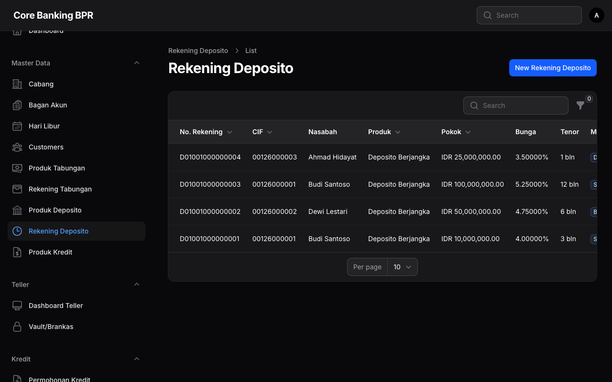
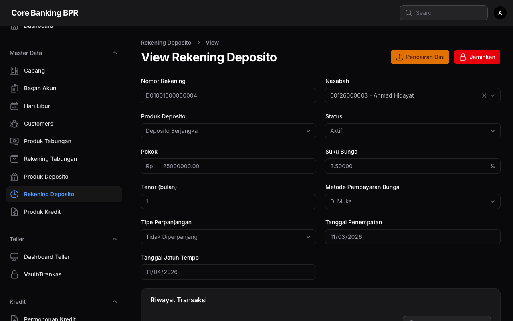

# Rekening Deposito

Halaman **Rekening Deposito** digunakan untuk mengelola data rekening deposito berjangka nasabah. Halaman ini menampilkan informasi penempatan deposito, suku bunga, tenor, serta status deposito secara lengkap.

## Hak Akses

| Role | Lihat | Tambah | Ubah | Hapus |
|------|:-----:|:------:|:----:|:-----:|
| Super Admin | ✅ | ✅ | ✅ | ✅ |
| Admin Cabang | ✅ | ✅ | ✅ | ❌ |
| Teller | ✅ | ❌ | ❌ | ❌ |
| Customer Service | ✅ | ✅ | ❌ | ❌ |
| Viewer | ✅ | ❌ | ❌ | ❌ |

!!! info "Filter Berdasarkan Cabang"
    Untuk role selain Super Admin, data rekening deposito yang ditampilkan secara otomatis difilter berdasarkan cabang pengguna yang sedang login.

---

## Daftar Rekening Deposito

Halaman daftar menampilkan seluruh rekening deposito dengan kolom-kolom berikut:

| Kolom | Keterangan |
|-------|------------|
| **Nomor Rekening** | Nomor unik rekening deposito. |
| **CIF** | Nomor Customer Information File nasabah pemilik deposito. |
| **Nama Nasabah** | Nama lengkap nasabah sesuai data CIF. |
| **Produk** | Jenis produk deposito yang dipilih saat penempatan. |
| **Pokok** | Nominal pokok penempatan deposito dalam format Rupiah (Rp). |
| **Suku Bunga** | Persentase suku bunga per tahun yang berlaku untuk deposito ini. |
| **Tenor** | Jangka waktu penempatan deposito dalam satuan bulan. |
| **Metode Pembayaran Bunga** | Metode pembayaran bunga deposito, ditampilkan dalam bentuk badge. |
| **Status** | Status rekening deposito ditampilkan dalam bentuk badge berwarna. |
| **Tanggal Penempatan** | Tanggal awal penempatan deposito. |
| **Tanggal Jatuh Tempo** | Tanggal deposito jatuh tempo sesuai tenor yang dipilih. |

### Metode Pembayaran Bunga

| Metode | Keterangan |
|--------|------------|
| **Kapitalisasi** | Bunga ditambahkan ke pokok deposito pada saat jatuh tempo. |
| **Transfer ke Rekening** | Bunga ditransfer secara berkala ke rekening tabungan nasabah. |
| **Tunai** | Bunga dibayarkan secara tunai kepada nasabah. |

### Filter yang Tersedia

Gunakan filter untuk mempersempit pencarian data:

- **Status** — Filter berdasarkan status rekening deposito.
- **Produk Deposito** — Filter berdasarkan jenis produk deposito.
- **Cabang** — Filter berdasarkan cabang (hanya tersedia untuk Super Admin).
- **Metode Pembayaran Bunga** — Filter berdasarkan metode pembayaran bunga.

---

## Detail Rekening Deposito

Halaman detail menampilkan informasi lengkap rekening deposito. Sebagian besar field bersifat **view-only** (disabled) karena data deposito diatur melalui proses transaksi, bukan melalui edit manual.

### Penjelasan Field

| Field | Tipe | Keterangan |
|-------|------|------------|
| **Nomor Rekening** | Disabled | Nomor rekening deposito yang digenerate oleh sistem. |
| **Nasabah** | Disabled | Nama dan CIF nasabah pemilik deposito. |
| **Produk** | Disabled | Produk deposito yang digunakan. |
| **Status** | Disabled | Status terkini rekening deposito. |
| **Pokok** | Disabled | Nominal pokok penempatan deposito dalam Rupiah. |
| **Suku Bunga** | Disabled | Persentase suku bunga per tahun yang berlaku. |
| **Tenor (Bulan)** | Disabled | Jangka waktu penempatan dalam bulan. |
| **Metode Pembayaran Bunga** | Disabled | Metode yang dipilih untuk pembayaran bunga. |
| **Tipe Rollover** | Disabled | Pengaturan perpanjangan otomatis saat jatuh tempo. |
| **Tanggal Penempatan** | Disabled | Tanggal awal penempatan deposito. |
| **Tanggal Jatuh Tempo** | Disabled | Tanggal jatuh tempo berdasarkan tenor. |

### Tipe Rollover

| Tipe | Keterangan |
|------|------------|
| **Non-Rollover** | Deposito tidak diperpanjang otomatis. Dana dikembalikan saat jatuh tempo. |
| **ARO (Automatic Rollover)** | Pokok deposito diperpanjang otomatis dengan tenor yang sama. Bunga ditransfer ke rekening nasabah. |
| **ARO + Bunga** | Pokok dan bunga deposito diperpanjang otomatis (dikapitalisasi) dengan tenor yang sama. |

---

## Relation Manager: Transaksi

Pada bagian bawah halaman detail, terdapat tabel **Riwayat Transaksi** yang mencatat seluruh aktivitas terkait rekening deposito.

| Kolom Transaksi | Keterangan |
|-----------------|------------|
| **Tanggal** | Tanggal dan waktu transaksi dilakukan. |
| **Tipe** | Jenis transaksi: Penempatan, Pencairan, Pembayaran Bunga, Perpanjangan. |
| **Jumlah** | Nominal transaksi dalam format Rupiah. |
| **Keterangan** | Catatan atau referensi transaksi. |
| **Petugas** | Nama petugas yang memproses transaksi. |

---

## Panduan Operasional

### Melihat Detail Deposito

1. Buka halaman **Daftar Rekening Deposito**.
2. Klik pada baris rekening yang ingin dilihat.
3. Halaman detail akan menampilkan seluruh informasi deposito beserta riwayat transaksi.

### Mencari Rekening Deposito

1. Gunakan kolom **pencarian** di bagian atas tabel untuk mencari berdasarkan nomor rekening atau nama nasabah.
2. Gunakan **filter** untuk mempersempit hasil berdasarkan status, produk, cabang, atau metode pembayaran bunga.

!!! note "Catatan Penting"
    Pembukaan deposito baru, pencairan, dan perpanjangan dilakukan melalui menu **Transaksi**, bukan melalui halaman ini. Halaman Rekening Deposito berfungsi sebagai pusat informasi dan monitoring rekening deposito yang sudah berjalan.

### Memantau Deposito Jatuh Tempo

1. Gunakan filter **Status** dan urutkan berdasarkan **Tanggal Jatuh Tempo** untuk melihat deposito yang akan segera jatuh tempo.
2. Deposito dengan tipe rollover **Non-Rollover** perlu diperhatikan karena memerlukan tindakan manual saat jatuh tempo.

!!! tip "Tips"
    Lakukan pengecekan rutin terhadap deposito yang akan jatuh tempo dalam 7 hari ke depan untuk memastikan kesiapan dana dan koordinasi dengan nasabah.

### Status Rekening Deposito

| Status | Keterangan |
|--------|------------|
| **Active** | Deposito sedang berjalan dan belum jatuh tempo. |
| **Matured** | Deposito telah jatuh tempo dan menunggu tindakan (pencairan atau perpanjangan). |
| **Closed** | Deposito telah dicairkan dan rekening ditutup. |
| **Rolled Over** | Deposito telah diperpanjang secara otomatis ke periode baru. |

!!! warning "Perhatian"
    Pencairan deposito sebelum jatuh tempo akan dikenakan denda sesuai dengan **Denda Rate** yang diatur pada produk deposito. Pastikan nasabah telah diinformasikan mengenai konsekuensi pencairan dini.
