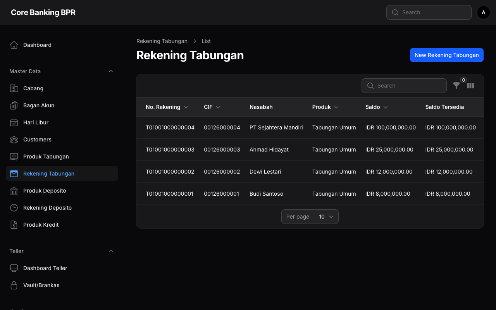
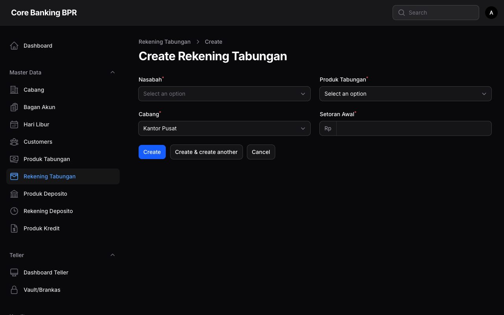
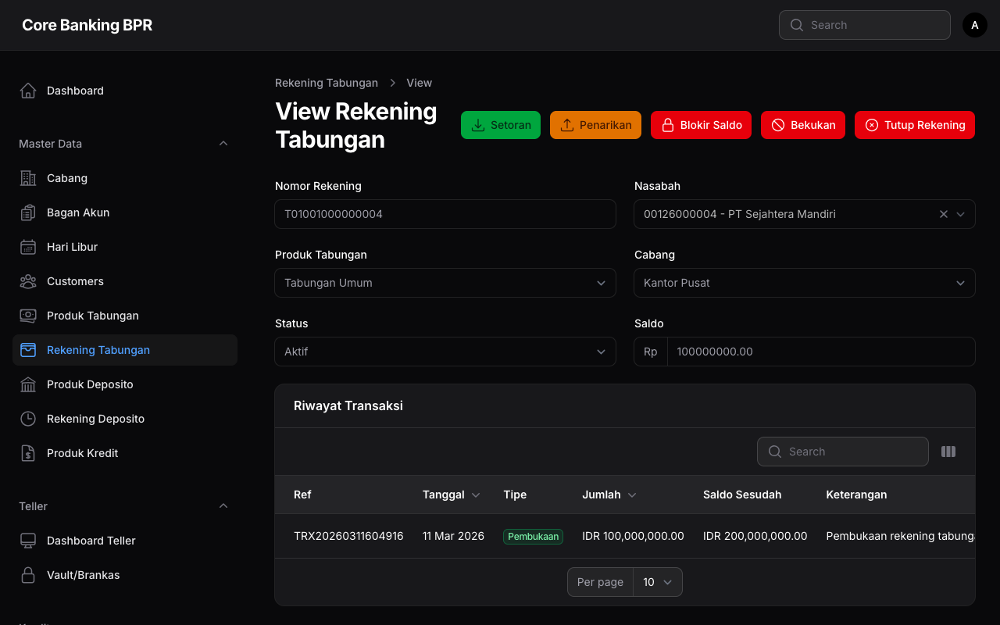

# Rekening Tabungan

Halaman **Rekening Tabungan** digunakan untuk mengelola seluruh data rekening tabungan nasabah. Melalui halaman ini, petugas dapat melihat daftar rekening, membuka rekening baru, serta memantau saldo dan status rekening.

## Hak Akses

| Role | Lihat | Tambah | Ubah | Hapus |
|------|:-----:|:------:|:----:|:-----:|
| Super Admin | ✅ | ✅ | ✅ | ✅ |
| Admin Cabang | ✅ | ✅ | ✅ | ❌ |
| Teller | ✅ | ✅ | ❌ | ❌ |
| Customer Service | ✅ | ✅ | ✅ | ❌ |
| Viewer | ✅ | ❌ | ❌ | ❌ |

!!! info "Filter Berdasarkan Cabang"
    Untuk role selain Super Admin, data rekening yang ditampilkan secara otomatis difilter berdasarkan cabang pengguna yang sedang login. Super Admin dapat melihat data dari seluruh cabang.

---

## Daftar Rekening Tabungan

Halaman daftar menampilkan seluruh rekening tabungan dengan kolom-kolom berikut:

| Kolom | Keterangan |
|-------|------------|
| **Nomor Rekening** | Nomor unik rekening tabungan. Dapat disalin dengan klik ikon copy. |
| **CIF** | Nomor Customer Information File nasabah pemilik rekening. |
| **Nama Nasabah** | Nama lengkap nasabah sesuai data CIF. |
| **Produk** | Jenis produk tabungan yang dipilih saat pembukaan rekening. |
| **Saldo** | Saldo akhir rekening dalam format Rupiah (Rp). |
| **Hold Amount** | Jumlah dana yang sedang ditahan (misalnya untuk jaminan atau blokir). |
| **Saldo Tersedia** | Saldo yang dapat ditransaksikan (Saldo dikurangi Hold Amount). |
| **Status** | Status rekening ditampilkan dalam bentuk badge berwarna. |
| **Tanggal Buka** | Tanggal pembukaan rekening. |

### Status Rekening

| Status | Warna Badge | Keterangan |
|--------|:-----------:|------------|
| **Active** | 🟢 Hijau | Rekening aktif dan dapat bertransaksi. |
| **Dormant** | 🟡 Kuning | Rekening tidak aktif dalam jangka waktu tertentu. |
| **Frozen** | 🔵 Biru | Rekening dibekukan, tidak dapat melakukan transaksi. |
| **Closed** | 🔴 Merah | Rekening telah ditutup secara permanen. |

### Filter yang Tersedia

Gunakan filter untuk mempersempit pencarian data:

- **Status** — Filter berdasarkan status rekening (Active, Dormant, Frozen, Closed).
- **Produk Tabungan** — Filter berdasarkan jenis produk tabungan.
- **Cabang** — Filter berdasarkan cabang (hanya tersedia untuk Super Admin).

---

## Membuka Rekening Baru

### Langkah-langkah Pembukaan Rekening

1. Klik tombol **Tambah Rekening** pada halaman daftar.
2. Isi formulir pembukaan rekening dengan data berikut.
3. Klik **Simpan** untuk membuat rekening baru.

### Penjelasan Field

| Field | Tipe | Keterangan |
|-------|------|------------|
| **Nomor Rekening** | Otomatis (disabled) | Nomor rekening digenerate secara otomatis oleh sistem dan tidak dapat diubah. |
| **Nasabah** | Select/Search | Pilih nasabah berdasarkan nama atau nomor CIF. Nasabah harus sudah terdaftar di sistem. |
| **Produk Tabungan** | Select | Pilih produk tabungan yang diinginkan. Produk harus berstatus aktif. |
| **Cabang** | Select | Cabang tempat rekening dibuka. Untuk non-admin, otomatis terisi sesuai cabang pengguna. |
| **Status** | Disabled | Status awal rekening otomatis diatur sebagai **Active** dan tidak dapat diubah saat pembukaan. |
| **Saldo** | Disabled | Saldo awal bernilai Rp 0. Saldo akan bertambah setelah dilakukan setoran awal. |

!!! warning "Perhatian"
    Pastikan data nasabah sudah lengkap dan terverifikasi sebelum membuka rekening baru. Rekening yang sudah dibuka tidak dapat dihapus, hanya dapat diubah statusnya.

---

## Detail Rekening

Halaman detail menampilkan informasi lengkap rekening tabungan, termasuk data nasabah, produk, saldo terkini, serta riwayat transaksi.

### Relation Manager: Transaksi

Pada bagian bawah halaman detail, terdapat tabel **Riwayat Transaksi** yang menampilkan seluruh transaksi setor dan tarik pada rekening tersebut.

| Kolom Transaksi | Keterangan |
|-----------------|------------|
| **Tanggal** | Tanggal dan waktu transaksi dilakukan. |
| **Tipe** | Jenis transaksi: Setoran atau Penarikan. |
| **Jumlah** | Nominal transaksi dalam format Rupiah. |
| **Saldo Setelah** | Saldo rekening setelah transaksi diproses. |
| **Keterangan** | Catatan atau referensi transaksi. |
| **Petugas** | Nama petugas yang memproses transaksi. |

---

## Panduan Operasional

### Mengubah Status Rekening

1. Buka halaman **Detail Rekening** yang ingin diubah statusnya.
2. Klik tombol **Edit**.
3. Ubah field **Status** sesuai kebutuhan.
4. Klik **Simpan** untuk menyimpan perubahan.

!!! note "Catatan"
    Perubahan status rekening dari **Closed** ke status lainnya tidak diperbolehkan. Rekening yang sudah ditutup bersifat permanen.

### Membekukan Rekening (Freeze)

1. Buka halaman **Detail Rekening**.
2. Klik tombol **Edit**.
3. Ubah status menjadi **Frozen**.
4. Klik **Simpan**.

!!! tip "Tips"
    Pembekuan rekening biasanya dilakukan atas permintaan nasabah, perintah pengadilan, atau investigasi internal. Pastikan untuk mendokumentasikan alasan pembekuan.

### Mencari Rekening

1. Gunakan kolom **pencarian** di bagian atas tabel untuk mencari berdasarkan nomor rekening atau nama nasabah.
2. Gunakan **filter** untuk mempersempit hasil pencarian berdasarkan status, produk, atau cabang.
3. Klik ikon **copy** pada kolom Nomor Rekening untuk menyalin nomor rekening ke clipboard.
