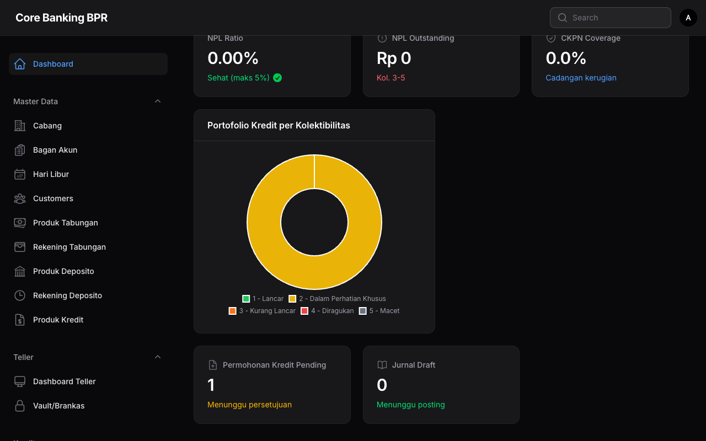

# Dashboard

Dashboard merupakan halaman utama yang ditampilkan setelah pengguna berhasil login ke sistem **Core Banking BPR**. Halaman ini menyajikan ringkasan kondisi keuangan bank secara real-time melalui empat widget utama.

---

## Widget Dashboard

### 1. Bank Overview Widget

Widget ini menampilkan statistik utama kinerja keuangan bank dalam bentuk kartu ringkasan.

| Indikator                    | Keterangan                                                  |
| ---------------------------- | ----------------------------------------------------------- |
| **Total Outstanding Kredit** | Total aset produktif bank berupa pinjaman yang disalurkan    |
| **Total Tabungan**           | Total dana pihak ketiga (DPK) berupa simpanan tabungan nasabah |
| **Total Deposito**           | Total dana pihak ketiga (DPK) berupa simpanan deposito berjangka |
| **Outstanding Kredit**       | Baki debet -- sisa pokok pinjaman yang belum dibayar nasabah |

!!! info "Data Real-Time"
    Seluruh angka pada widget Bank Overview diperbarui secara otomatis setiap kali halaman Dashboard dimuat. Data diambil langsung dari saldo terkini di database.

### 2. NPL Ratio Widget

Widget ini menampilkan indikator kesehatan portofolio kredit bank berdasarkan rasio **Non-Performing Loan (NPL)**.

| Indikator          | Keterangan                                                          |
| ------------------ | ------------------------------------------------------------------- |
| **NPL Ratio**      | Persentase kredit bermasalah terhadap total kredit yang disalurkan   |
| **NPL Outstanding**| Nominal kredit dengan kolektibilitas 3 (Kurang Lancar), 4 (Diragukan), dan 5 (Macet) |
| **CKPN Coverage**  | Cadangan Kerugian Penurunan Nilai -- cadangan yang dibentuk bank untuk menutup potensi kerugian kredit |

!!! warning "Batas NPL Sehat"
    Rasio NPL yang sehat berada di bawah **5%** sesuai ketentuan Otoritas Jasa Keuangan (OJK). Jika NPL melebihi ambang batas tersebut, bank perlu segera melakukan langkah penanganan kredit bermasalah seperti restrukturisasi atau penagihan intensif.

!!! tip "Monitoring Berkala"
    Pantau NPL Ratio secara harian melalui Dashboard untuk mendeteksi tren penurunan kualitas kredit sejak dini. Tindakan preventif lebih efektif dibandingkan tindakan kuratif.

### 3. Loan Portfolio Chart

Widget ini menampilkan **grafik donat (doughnut chart)** yang menggambarkan komposisi portofolio kredit berdasarkan tingkat kolektibilitas.

| Kolektibilitas                     | Warna   | Keterangan                                          |
| ---------------------------------- | ------- | --------------------------------------------------- |
| **Kol. 1 -- Lancar**              | Hijau   | Kredit dengan pembayaran lancar tanpa tunggakan      |
| **Kol. 2 -- Dalam Perhatian Khusus** | Kuning  | Kredit dengan tunggakan 1--90 hari                  |
| **Kol. 3 -- Kurang Lancar**       | Oranye  | Kredit dengan tunggakan 91--120 hari                 |
| **Kol. 4 -- Diragukan**           | Merah   | Kredit dengan tunggakan 121--180 hari                |
| **Kol. 5 -- Macet**               | Abu-abu | Kredit dengan tunggakan lebih dari 180 hari          |

!!! info "Klasifikasi Kolektibilitas"
    Klasifikasi kolektibilitas mengacu pada ketentuan OJK mengenai Kualitas Aset Produktif. Perubahan kolektibilitas dihitung secara otomatis oleh sistem pada saat proses **End of Day (EOD)**.

### 4. Pending Approvals Widget

Widget ini menampilkan item-item yang memerlukan tindakan persetujuan dari pejabat berwenang.

| Item                | Keterangan                                                           |
| ------------------- | -------------------------------------------------------------------- |
| **Kredit Pending**  | Jumlah pengajuan kredit dengan status **Submitted** atau **Under Review** yang menunggu keputusan |
| **Jurnal Draft**    | Jumlah jurnal akuntansi dengan status **Draft** yang belum disetujui |

!!! tip "Tindak Lanjut Cepat"
    Klik pada angka di Pending Approvals Widget untuk langsung menuju halaman daftar item yang perlu diproses. Pastikan pengajuan kredit dan jurnal draft ditindaklanjuti secara tepat waktu untuk menjaga kelancaran operasional bank.

---

## Akses Dashboard Berdasarkan Peran

Tidak semua peran dapat melihat seluruh widget pada Dashboard. Berikut adalah visibilitas widget berdasarkan peran pengguna:

| Widget                  | SuperAdmin | BranchManager | Accounting | LoanOfficer | Teller | CustomerService | Auditor | Compliance |
| ----------------------- | :--------: | :-----------: | :--------: | :---------: | :----: | :-------------: | :-----: | :--------: |
| Bank Overview           | V          | V             | V          | -           | -      | -               | V       | -          |
| NPL Ratio               | V          | V             | V          | V           | -      | -               | V       | V          |
| Loan Portfolio Chart    | V          | V             | V          | V           | -      | -               | V       | V          |
| Pending Approvals       | V          | V             | V          | V           | -      | -               | -       | -          |

!!! info "Tampilan Sesuai Peran"
    Dashboard secara otomatis menyesuaikan widget yang ditampilkan berdasarkan peran pengguna yang sedang login. Pengguna hanya akan melihat widget yang relevan dengan tugasnya.
