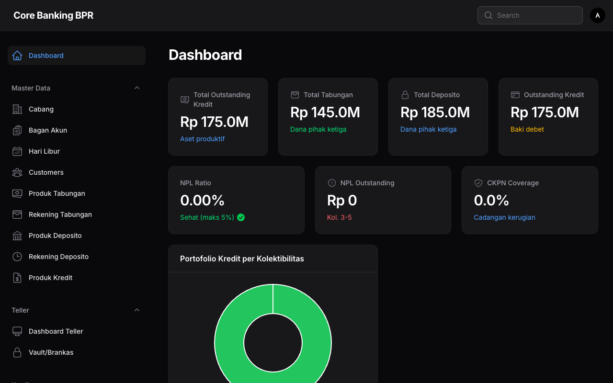
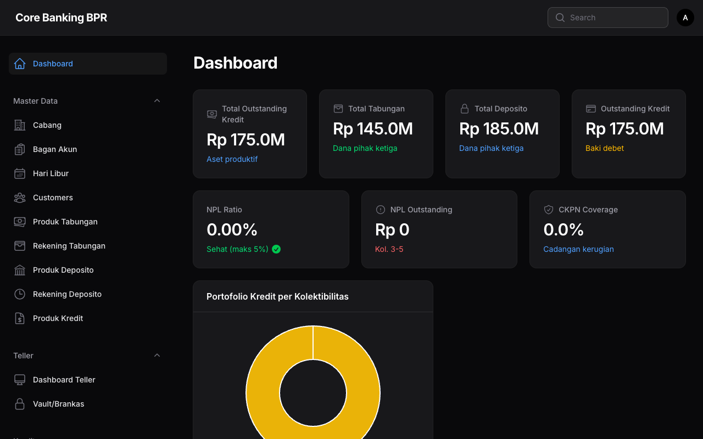

# Login & Navigasi

Panduan lengkap untuk masuk ke sistem **Core Banking BPR** dan memahami tata letak navigasi aplikasi.

## Login

Halaman login dapat diakses melalui URL `/admin/login`. Pengguna harus memasukkan **email** dan **password** yang telah terdaftar di sistem.

!!! info "Tema Gelap (Dark Mode)"
    Core Banking BPR menggunakan tema gelap (_dark mode_) secara bawaan untuk kenyamanan pengguna saat bekerja dalam waktu lama.

### Langkah Login

1. Buka halaman `/admin/login` pada browser.
2. Masukkan **alamat email** yang terdaftar.
3. Masukkan **password** akun Anda.
4. Klik tombol **Sign in** untuk masuk ke Dashboard.

!!! warning "Keamanan Akun"
    Jangan bagikan kredensial login Anda kepada siapa pun. Jika Anda lupa password, hubungi administrator sistem untuk melakukan reset password.

## Navigasi Aplikasi

Core Banking BPR menggunakan mode **SPA (Single Page Application)** sehingga perpindahan antar halaman terasa cepat dan mulus tanpa memuat ulang seluruh halaman.

### Sidebar Menu

Sidebar di sisi kiri layar merupakan navigasi utama aplikasi. Menu dikelompokkan berdasarkan fungsi operasional bank:

| Grup Menu       | Deskripsi                                                        |
| --------------- | ---------------------------------------------------------------- |
| **Master Data** | Pengelolaan data nasabah, produk tabungan, produk deposito, dan produk kredit |
| **Teller**      | Operasional teller: buka/tutup sesi, setor tunai, tarik tunai    |
| **Kredit**      | Pengajuan kredit, pencairan, pembayaran angsuran, monitoring kolektibilitas |
| **Akuntansi**   | Chart of Account, jurnal umum, proses EOD (End of Day)           |
| **Operasional** | Operasional harian bank dan pengaturan sistem                    |
| **Laporan**     | Laporan keuangan, laporan regulasi, dan ekspor data              |
| **Administrasi**| Manajemen pengguna, peran, audit trail, dan konfigurasi sistem   |

### Bilah Pencarian (Search Bar)

Di bagian **kanan atas** layar terdapat bilah pencarian yang memungkinkan Anda mencari menu, halaman, atau fitur tertentu dengan cepat. Cukup ketikkan kata kunci dan pilih hasil yang sesuai.

!!! tip "Pintasan Pencarian"
    Gunakan fitur pencarian untuk berpindah antar halaman dengan cepat tanpa harus membuka menu sidebar satu per satu.

### Menu Pengguna (User Avatar)

Di **pojok kanan atas** terdapat ikon avatar pengguna. Klik ikon tersebut untuk menampilkan menu dropdown dengan opsi berikut:

- **Profile** -- Mengelola informasi profil dan mengubah password.
- **Logout** -- Keluar dari sistem Core Banking BPR.

!!! info "Sesi Aktif"
    Sistem akan secara otomatis mengeluarkan pengguna setelah periode tidak aktif tertentu demi keamanan. Pastikan untuk menyimpan pekerjaan Anda secara berkala.
