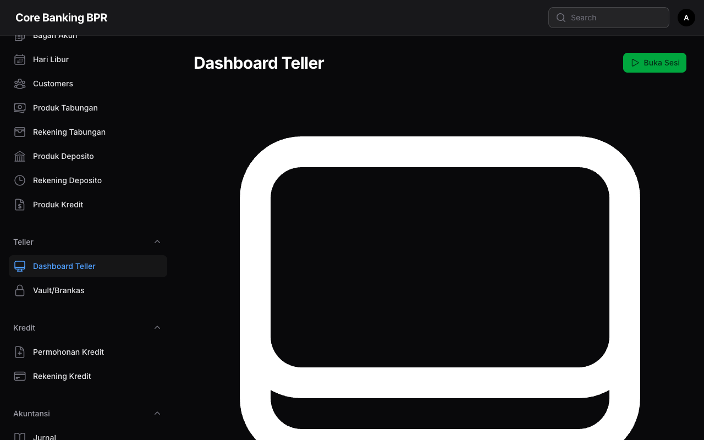

# Dashboard Teller

Halaman Dashboard Teller merupakan pusat kendali utama bagi petugas teller dalam melakukan transaksi harian. Dashboard ini dibangun sebagai custom Filament page yang dapat diakses melalui menu navigasi admin.

## Informasi Akses

| Item            | Detail                          |
| --------------- | ------------------------------- |
| **URL**         | `/admin/teller-dashboard`       |
| **Permission**  | `teller.open-session`           |
| **Menu**        | Teller > Dashboard              |
| **Role**        | Teller, Supervisor, Admin       |

## Tampilan Dashboard

Dashboard Teller memiliki dua kondisi tampilan yang berbeda tergantung pada status sesi teller.

### 1. Belum Ada Sesi Aktif

Ketika teller belum membuka sesi, dashboard hanya menampilkan tombol **Buka Sesi**. Tidak ada informasi transaksi atau saldo yang ditampilkan pada kondisi ini.

!!! warning "Sesi Wajib Dibuka"
    Teller harus membuka sesi terlebih dahulu sebelum dapat melakukan transaksi apapun (setor, tarik, bayar angsuran).

### 2. Sesi Aktif

Setelah sesi dibuka, dashboard menampilkan informasi lengkap berikut:

#### Kartu Informasi Sesi

| Kartu              | Keterangan                                      |
| ------------------- | ------------------------------------------------ |
| **Kas Awal**        | Saldo kas yang diinput saat membuka sesi         |
| **Saldo Saat Ini**  | Saldo kas terkini setelah seluruh transaksi      |
| **Total Kas Masuk** | Akumulasi seluruh penerimaan kas selama sesi     |
| **Total Kas Keluar**| Akumulasi seluruh pengeluaran kas selama sesi    |
| **Jumlah Transaksi**| Total transaksi yang telah diproses selama sesi  |

#### Informasi Vault

Dashboard juga menampilkan informasi vault (brankas) yang dipilih saat membuka sesi, termasuk nama vault dan saldo vault saat ini.

## Tombol Aksi

Dashboard menyediakan empat tombol aksi utama untuk operasional teller:

| Tombol              | Fungsi                                         | Keterangan                     |
| ------------------- | ---------------------------------------------- | ------------------------------ |
| **Buka Sesi**       | Membuka sesi teller baru                       | Tampil saat belum ada sesi     |
| **Setor Tabungan**  | Menerima setoran tabungan nasabah              | Memerlukan sesi aktif          |
| **Tarik Tabungan**  | Memproses penarikan tabungan nasabah           | Memerlukan sesi aktif          |
| **Bayar Angsuran**  | Menerima pembayaran angsuran kredit            | Memerlukan sesi aktif          |
| **Tutup Sesi**      | Menutup sesi teller yang sedang aktif          | Tampil saat sesi aktif         |

!!! info "Sesi Aktif Diperlukan"
    Tombol Setor Tabungan, Tarik Tabungan, dan Bayar Angsuran hanya aktif ketika teller memiliki sesi yang sedang berjalan.

## Tabel Transaksi Terakhir

Dashboard menampilkan 10 transaksi terakhir yang diproses selama sesi aktif dalam format tabel:

| Kolom          | Keterangan                                    |
| -------------- | --------------------------------------------- |
| **Waktu**      | Waktu transaksi dilakukan                     |
| **Tipe**       | Jenis transaksi (Setor, Tarik, Angsuran)      |
| **Rekening**   | Nomor rekening terkait                        |
| **Nasabah**    | Nama nasabah pemilik rekening                 |
| **Jumlah**     | Nominal transaksi dalam Rupiah                |
| **Keterangan** | Catatan atau deskripsi transaksi              |

## Riwayat Sesi Sebelumnya

Bagian bawah dashboard menampilkan daftar riwayat sesi teller yang telah ditutup sebelumnya, termasuk informasi tanggal, kas awal, kas akhir, dan jumlah transaksi pada masing-masing sesi.

## Screenshot

## Lihat Juga

- [Buka & Tutup Sesi](buka-tutup-sesi.md)
- [Setor Tabungan](setor-tabungan.md)
- [Tarik Tabungan](tarik-tabungan.md)
- [Bayar Angsuran](bayar-angsuran.md)
- [Vault / Brankas](vault.md)
