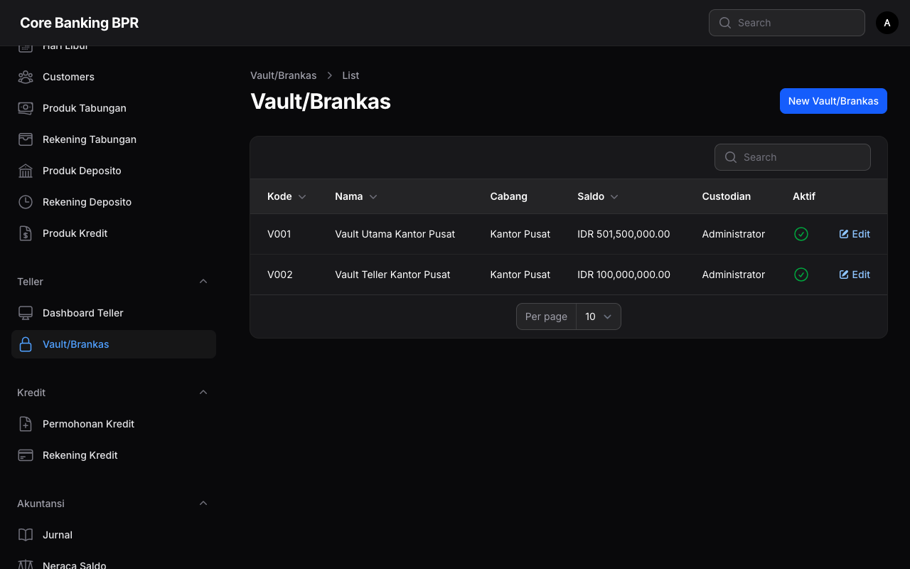
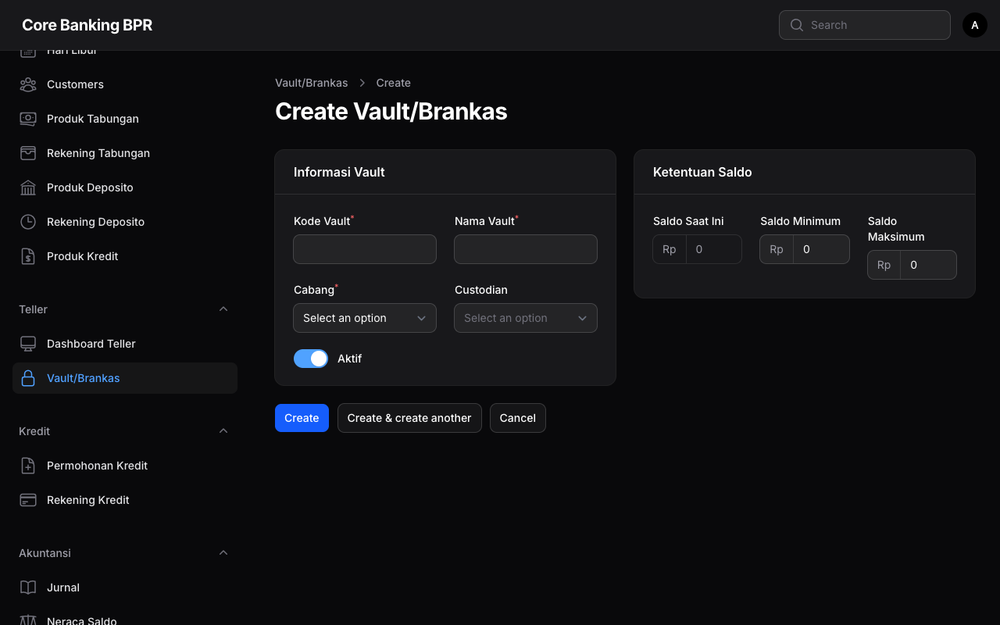

# Vault / Brankas

Vault (Brankas) merupakan entitas yang merepresentasikan tempat penyimpanan kas fisik di setiap cabang. Teller memilih vault saat membuka sesi untuk menentukan sumber kas yang digunakan selama transaksi harian.

## Informasi Akses

| Item            | Detail                          |
| --------------- | ------------------------------- |
| **URL**         | `/admin/vaults`                 |
| **Permission**  | Manajemen Vault                 |
| **Menu**        | Teller > Vault                  |
| **Role**        | Supervisor, Admin               |

## Daftar Vault

Halaman daftar vault menampilkan seluruh vault yang terdaftar dalam sistem dalam format tabel.

| Kolom                  | Keterangan                                          |
| ---------------------- | --------------------------------------------------- |
| **Kode**               | Kode unik identifikasi vault                        |
| **Nama**               | Nama vault                                          |
| **Cabang**             | Cabang tempat vault berada                          |
| **Saldo**              | Saldo kas saat ini dalam format Rupiah              |
| **Penanggung Jawab**   | Nama user yang bertanggung jawab atas vault         |
| **Aktif**              | Status aktif/nonaktif vault                         |

## Formulir Vault

Formulir berikut digunakan untuk membuat vault baru atau mengedit vault yang sudah ada.

| Field                  | Tipe Input        | Wajib | Keterangan                                       |
| ---------------------- | ----------------- | ----- | ------------------------------------------------- |
| **Kode**               | Text              | Ya    | Kode unik vault, tidak boleh duplikat             |
| **Nama**               | Text              | Ya    | Nama deskriptif vault                             |
| **Cabang**             | Select             | Ya    | Pilih cabang tempat vault berada                  |
| **Penanggung Jawab**   | Select (relasi)   | Ya    | Pilih user yang bertanggung jawab atas vault      |
| **Aktif**              | Toggle             | Ya    | Status aktif/nonaktif vault                       |
| **Saldo**              | Numeric (disabled) | -    | Saldo saat ini, hanya dapat berubah melalui transaksi |
| **Saldo Minimum**      | Numeric (Rp)      | Tidak | Batas minimum saldo vault                         |
| **Saldo Maksimum**     | Numeric (Rp)      | Tidak | Batas maksimum saldo vault                        |

!!! info "Saldo Vault"
    Field saldo pada formulir bersifat **disabled** (tidak dapat diedit secara langsung). Saldo vault hanya berubah melalui transaksi yang dilakukan oleh teller saat membuka/menutup sesi atau melalui proses transfer antar vault.

### Membuat Vault Baru

1. Buka halaman **Vault** melalui menu navigasi.
2. Klik tombol **Tambah Vault** atau **Create**.
3. Isi seluruh field yang diperlukan pada formulir.
4. Pastikan **Kode** vault bersifat unik dan belum digunakan.
5. Pilih **Penanggung Jawab** yang sesuai.
6. Klik **Simpan** untuk menyimpan vault baru.

### Mengedit Vault

1. Pada halaman daftar vault, klik vault yang ingin diedit.
2. Ubah field yang diperlukan.
3. Klik **Simpan** untuk menyimpan perubahan.

!!! warning "Nonaktifkan Vault"
    Vault yang dinonaktifkan tidak akan muncul pada pilihan vault saat teller membuka sesi. Pastikan tidak ada sesi aktif yang menggunakan vault tersebut sebelum menonaktifkannya.

## Saldo Minimum dan Maksimum

| Parameter          | Fungsi                                                          |
| ------------------ | --------------------------------------------------------------- |
| **Saldo Minimum**  | Batas bawah saldo vault sebagai peringatan ketersediaan kas     |
| **Saldo Maksimum** | Batas atas saldo vault sebagai kontrol keamanan penyimpanan kas |

!!! note "Fungsi Batas Saldo"
    Saldo minimum dan maksimum berfungsi sebagai parameter kontrol internal. Sistem dapat memberikan peringatan ketika saldo vault mendekati atau melampaui batas yang ditentukan.

## Hubungan Vault dengan Sesi Teller

Vault berperan penting dalam alur kerja teller:

1. Saat **membuka sesi**, teller memilih vault yang akan digunakan dan menginput kas awal.
2. Seluruh transaksi selama sesi tercatat sebagai pergerakan kas dari/ke vault tersebut.
3. Saat **menutup sesi**, saldo vault diperbarui berdasarkan seluruh transaksi yang terjadi.

## Lihat Juga

- [Dashboard Teller](dashboard-teller.md)
- [Buka & Tutup Sesi](buka-tutup-sesi.md)
